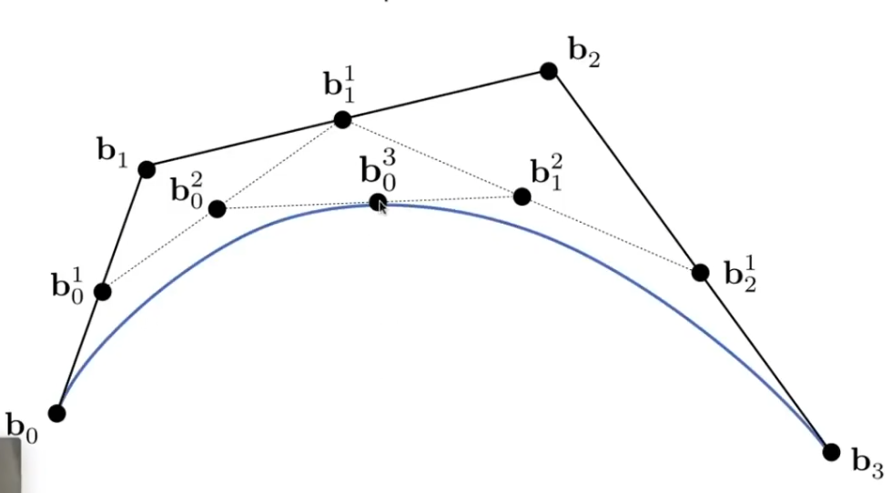

## 前言

[GAMES101-11](https://www.bilibili.com/video/BV1X7411F744/?p=11):贝塞尔曲线与B样条

[GAMES101-12](https://www.bilibili.com/video/BV1X7411F744/?p=12):贝塞尔曲线与B样条 <!-- more -->

## 贝塞尔曲线 Bézier Curve

贝塞尔曲线要求给定多于两个点，那么从第一个首尾两个点决定始末，中间的点决定倾向（往哪里弯）。

德卡斯特里奥算法（de casteljau's algorithm）有一种简单的递归画贝塞尔曲线的方法：

0. 假设我们依次有四个点 $b_0,b_1,b_2,b_3$，即三次贝塞尔曲线；一个点在曲线上运动，定义时间t = 0的时候在起点 $b_1$，t = 1 在终点 $b_0$。
1. 连接 $b_0,b_1,b_2,b_3$，找到三条连线线上的 t 位置，定义此点为 $b^1_0$、$b^1_1$、$b^1_2$；
2. 连接 $b^1_0$、$b^1_1$、$b^1_2$，继续找 t 时刻位置得到 $b^2_0$、$b^2_1$；
3. 连接 $b^2_0$、$b^2_1$ 找 t 位置的点 P($b^3_0$)；
4. P 就是时间 t 的时刻贝塞尔曲线上的点。

    

下面给出代数写法。

1. 对第一次递归的点可以写成形如 $b_0^1 = (1-t)b_0+tb_1$ 的形式；
2. 第二次递归的点等于$b_0^2 = (1-t)b_0^1+tb_1^1=(1-t)^2b_0+2t(1-t)b_1+t^2b_2$，可以看到系数是二次项展开的形式；
3. 第 n 次递归同理……

最终有

$$b^n(t)= \sum^n_{j=0}b_jB^n_j(t)$$

其中

$$
b_i^n(t)= C_i^nt^i(1-t)^{n-i}=\binom{n}{i}t^i(1-t)^{n-i}
$$

其中 $t^i$ 前面的系数都是在表示组合数。

贝塞尔曲线的一些性质：

1. 曲线的起点是第一个给出点，终点是最后一个点；
2. 对于最常用的三次贝塞尔曲线，起点处斜率为 $b'(0)=3(b1-b0)$，终点处为 $b'(3)=3(b3-b2)$；
3. 对贝塞尔曲线仿射变换等于对点进行仿射变换再求其贝塞尔曲线；
4. 贝塞尔曲线一定在给定点的凸包内；

> 凸包：想象一个撑在几个钉子上的橡皮筋，橡皮筋即钉子们的凸包

### 分段贝塞尔曲线与连续

多次贝塞尔曲线存在的问题：多次贝塞尔曲线点对线的控制不够直观明显，很难体现具体一个点对曲线的影响。

因此，最常用的贝塞尔曲线是三次贝塞尔曲线，通过拼接多个贝塞尔曲线形成长曲线。这样一来，我们就需要考虑在拼接处的连续问题。要讨论两段曲线是否连续，我们先定义连续的概念：

- $G^0$($C^0$)连续：两个曲线在该点首尾相连
- $G^0$：拼接点切向量方向相同
  - $C^0$：拼接点切向量方向和大小均相同
- $G^n$：拼接点切向量从 1 阶直到 n 阶导数的方向相同
  - $C^n$：拼接点切向量从 1 阶直到 n 阶导数的方向和大小均相同

其中 $C^i$ 叫参数连续，$G^i$ 叫几何连续。

## B 样条

样条：一条可控的曲线，分段定义的多项式参数曲线。

> 早期工程制图时，制图者将一段柔性的条板固定住，中间用一些钉子等工具迫使条板弯曲并固定来得到一条需要的曲线。这个条板就是样条。

B 样条是指基函数样条（basis spline）。B 样条是贝塞尔曲线的一种一般化，在贝塞尔曲线里基函数是伯恩斯坦多项式。B 样条有一些很好的性质，例如局部性：更改一个点不会影响到整条曲线而可以只修改其局部。

> 一个基函数空间里，所有的函数可以用基函数的线性组合表示。
>
> 伯恩斯坦多项式里，每一个项是一个基函数。

## 贝塞尔曲面

在两个方向都进行贝塞尔曲线，例如水平方向每隔一段进行一次贝塞尔，然后竖直方向上没处把对应的取值作为控制点进行贝塞尔。

## 网格的几何处理

- 网格细分：网格拆分为更细的网格，并使模型变得更光滑；
- 网格简化：网格太细合为更大的网格；
- 网格正则化：让网格更接近“正”图形（如正三角形），减少网格的依赖。

### 网格细分

网格细分的两步操作：分出更多的网格、调整顶点位置使得模型更光滑。

#### Loop 细分

> 请注意这里的 Loop 是人名而非循环

步骤：

1. 将一个三角形的中点连接，分成四个小三角形，这些中点是新的顶点；
2. 对于新顶点，其在两个三角形的公用边上。假定此边两个老顶点为 AB，非此边上的老顶点为 CD。那么新顶点的位置改为：$\frac{3}{8}(A+B)+\frac{1}{8}(C+D)$;
3. 对于老顶点，其是多个三角形的共用顶点。那么它的新位置为$P'=(1-nu)P_0+u\sum P_i$，其中
   1. $P_0$ 是该点原本坐标，$P_i$ 是与其通过一条边直接连接的点的坐标；
   2. n 是该点的度，即有多少个边与之相连；
   3. 若 n=3，则 $u=\frac{3}{16}$，否则，$u=\frac{3}{8n}$

> 老顶点的公式暗示：一个点如果连接的点越多，那么这个点的新坐标受周围点的影响就越大，否则，受自己的影响更大。

#### Catmull-Clark 细分

Catmull-Clark 可以对任意情况的网格使用而不局限于三角形网格。

定义奇异点：任何度不为 4 的顶点。

步骤：

1. 每个边的中点和每一个面的中点都是新的顶点，并且连接一个面内的边中点和面中点；

   > 经过这么一次细分以后，所有的非四边形面都不见了，而且同时会增加原本非四边形面那么多的奇异点。
2. 对于
    - 面中点：四个相邻老顶点的平均
    - 边中点：两个相连的老顶点和两个面中点的平均
    - 老顶点：四个面中点的一倍、四个边中点的两倍、本身位置的四倍的和进行平均

### 网格简化

有时我们希望在保留整体大致形状的情况下减少面的数量降低运算的压力，就需要网格简化。一种网格简化算法是**边坍缩**。边坍缩即把一个边两边的点挪动到一起使得该边“坍缩消失”。为了解决哪些边应该坍缩、探索后的点应该在哪的问题，我们则需要使用到二次误差度量算法。

二次度量误差：坍缩后的点的位置是原先有关面上点的距离的平方和（L2距离）的最小值的位置。

于是算法的核心思想：维护一个优先队列存储每条边坍缩会带来的二次度量误差，依次坍缩带来误差小的边，并更新受影响的边的误差值。

> 这是一种贪心算法，但是整体的效果还是不错的

## 跳转

Home:[GAMES101-1：课程总览与笔记导航](GAMES10101.html)

Prev:[GAMES101-10&11：隐式几何与显式几何](GAMES10109.html)

Next：[GAMES101-12&13：Whitted-Style 光线追踪（1）](GAMES10111.html)
