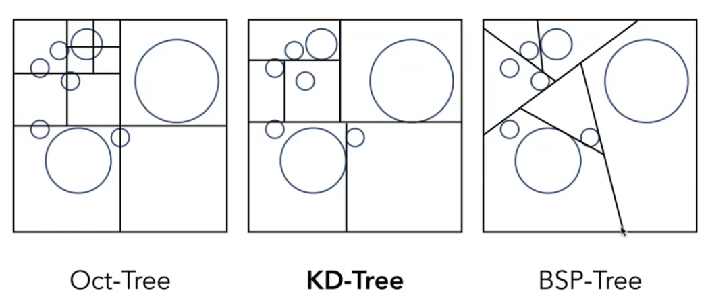

## 前言

[GAMES101-14](https://www.bilibili.com/video/BV1X7411F744/?p=14):  AABB 包围盒的加速方法：均匀网格、KD-Tree 划分、BVH 划分 <!-- more -->

## 均匀网格（Uniform Grid）/均匀空间划分

思想/步骤：

1. 建立一个大的 AABB 包围盒包围对空间中的所有物体，包围盒划分成均匀的若干立方网格；
2. 每个网格判断与物体（的表面）是否相交并记录；
3. 光线穿过空间中的若干网格，如果穿过的网格是一个与物体有交点的网格，那么光线与物体就有可能有交点。此时，对物体进行求交操作；否则，不进行求交。

   > 光线穿过网格的算法和光栅化中的扫描线算法是类似的

网格划分的疏密问题

- 太稀疏：加速效果不明显；
- 太密：引入太多无效的网格判断，效率降低；
- （三维空间）合适的格子数：约等于 27 * 物体数。

网格划分思想**适用于**大量尺度接近的物体均匀分布在空间中的情况，不适用于空间分布很不均匀的情况（局部引起太稀疏的问题）

## 空间划分（Spatial Partition）

均匀空间划分的明显问题在于：如果空间分布疏密不一，在大块空的地方做了许多没有必要的划分。如果对空间进行不均匀的划分那么性能就会更好。

下面例举三种划分结构：

- Oct-Tree（八叉树）：把三维空间划分为八份（二维则是四份），如果一块中有物体，则尝试划分得更小，否则就停下这一块的继续划分。
  > 这种划分方式的问题在于，划分数量与空间维度有关，不同维度的空间会形成了不同的数据结构。
- BSP-Tree：从不同方向用线/平面/超平面二分空间。这种方式高维难以计算且破坏 AABB 的简单性。
- KD-Tree：每次沿一个维度切一刀，例如三维空间就可以依次沿 x，y，z 轴切，二维则沿 x，y 轴切，从而使划分与空间维度无关。最后会形成一个二叉树。

> 这一部分与多媒体数据课在向量空间归类的思想很相似

### KD-Tree

为树设计的数据结构应该：

- 在内部节点上：
  - 划分轴：此结点应该被哪个轴划分
  - 划分位置：轴在哪个位置坐标划分
  - 子结点指针
  - *不*存储内部有哪些物体
- 叶子结点：存储内部有哪些物体

当光线进入一个空间划分区：

- 如果该区域有交点，那么检查是否是叶子结点
  - 是：检查是否与内部物体有交点
  - 否：检查与哪个子划分有交点
- 和该区域无交点：什么都不用做

不过，KD-Tree 也有自己的问题，如：

- 难以判断三角形与空间盒的相交情况：例如一个小盒子，三个顶点都在盒子外但是面与盒子有交集的情况。
- 一个物体可能会被划分到多个盒子里，多次检测。

## 物体划分：BVH（Bounding Volume Hierarchy）

BVH 的特点在于是按物体而非空间进行划分，对于一个包围盒，递归地将其划分为子空间并计算子空间的子包围盒的边界。重复这个过程，直到盒子足够小（例如大致都有 x 个 物体）即可。数据结构上，同样是叶子结点存物体的树。

划分维度上可以有许多技巧，例如类似 KD-Tree 的依次轮换维度，或者每次从盒子最长的维度划分；抑或着每次从中间物体的位置划分。总之，应该尽量让空间划分均匀。

> 存在O（N）算法找到中位数，快速选择算法。

需要注意，由于是按物体进行划分，从空间上来说，包围盒之间可以相交。

## 跳转

Home:[GAMES101-1：课程总览与笔记导航](GAMES10101.html)

Prev:[GAMES101-12&13：Whitted-Style 光线追踪（1）](GAMES10111.html)

Next：[GAMES101-14&15：辐射度量学](GAMES10113.html)
