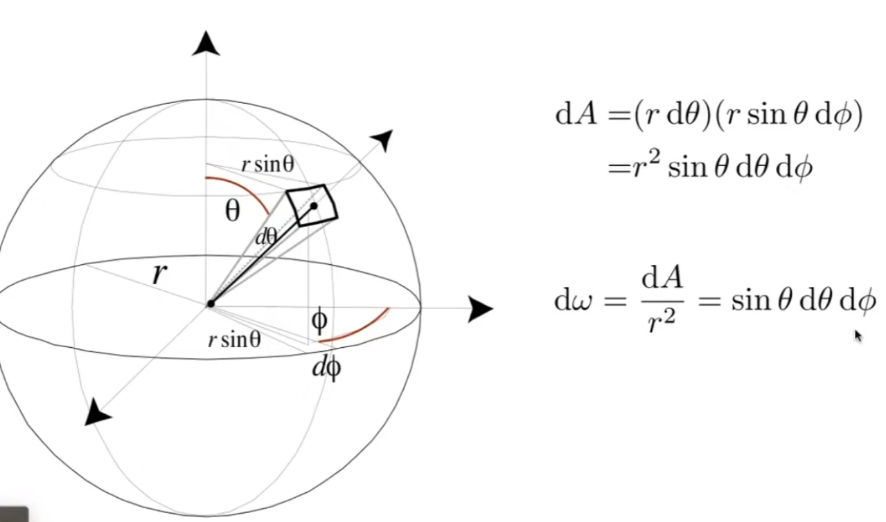
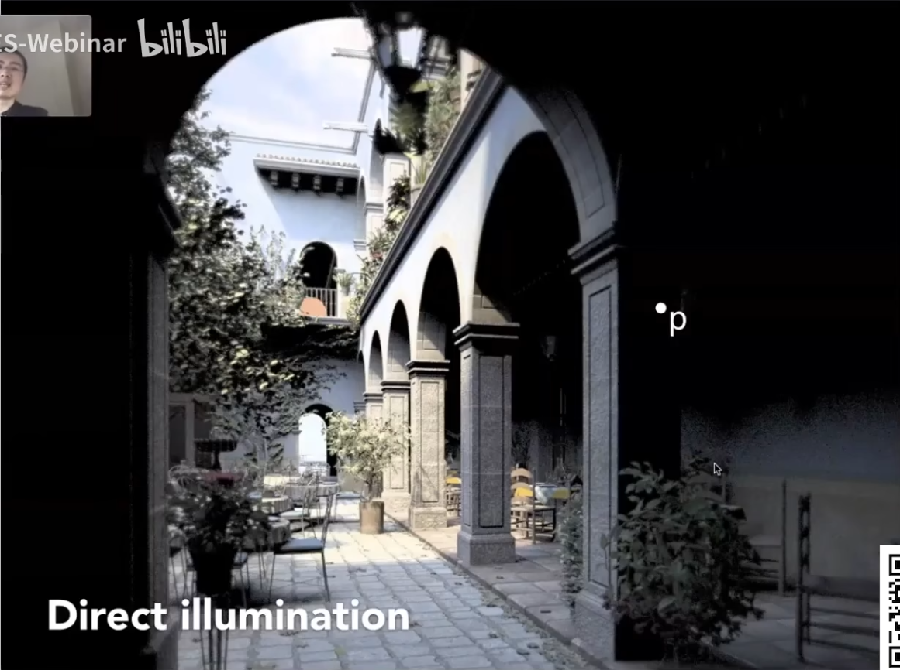
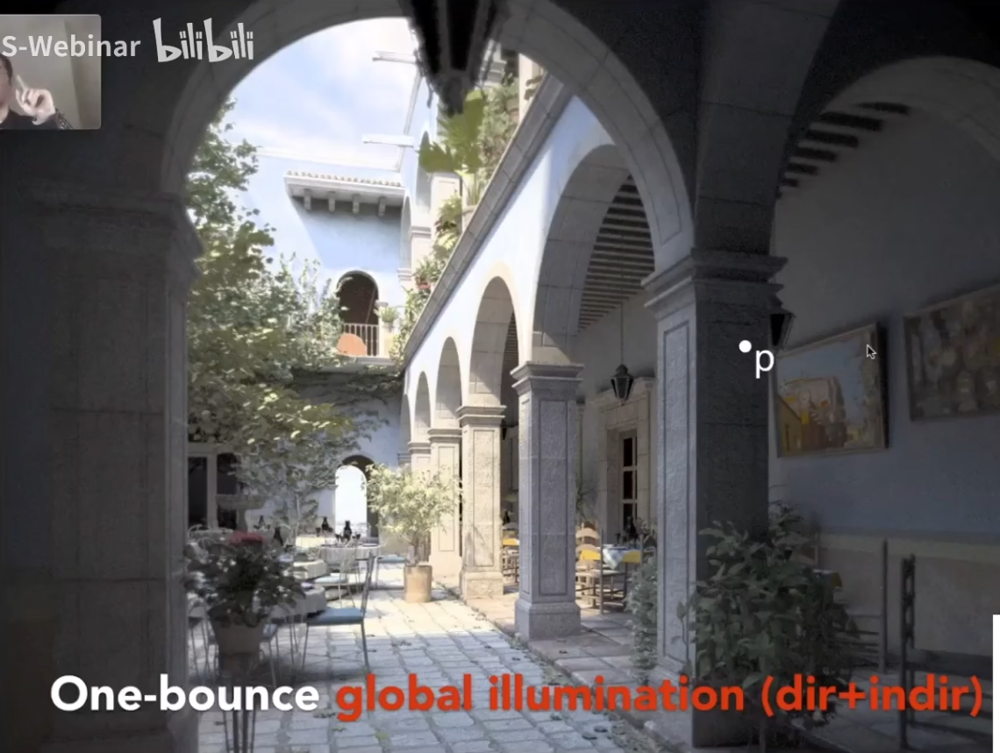
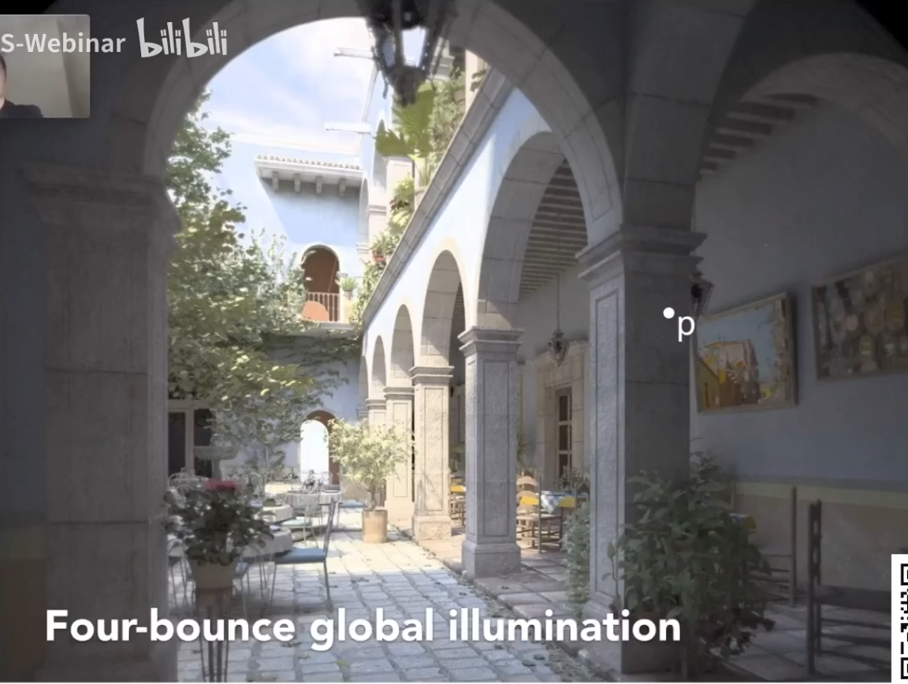

## 前言

[GAMES101-14](https://www.bilibili.com/video/BV1X7411F744/?p=14):辐射度量学的意义、能量，功率与辐射强度（intensity）的定义。

[GAMES101-15](https://www.bilibili.com/video/BV1X7411F744/?p=15):辐射度量学的基本概念：辐照强度、辐射通量，BRDF，渲染方程，全局光照 <!-- more -->

## 辐射度量学

为什么要研究辐射度量学：Whitted-Style 光线追踪尽管可以在一些场景表现不错，但是其建立完全是基于经验值和表现的效果的，而不是实际的物理规律，因此其值不可能完全真实准确。这就是为什么我们需要辐射度量学。

要进行严谨度量，我们就要先定义单位（中文均为个人翻译，课程中没有中文名）：

- 辐射能 Radiant Energy：辐射出的能量 Q $(J)$。
- 辐射速率/功率 Radiant flux（power）：单位时间内辐射/吸收/反射的能量。对于光源即“有多亮” .$\Phi=\frac{\mathrm{d}Q}{\mathrm{d}t}$ ，单位 $\mathrm{W(Watt)/lm(lumen)}$
  > **注意**：下文和图形学中说到的能量往往是指 flux 而非 energy，因为我们总是在关心眼下发生的情况（实时）而非累计的结果。
- 辐射强度 Radiant Intensity：一个单位立体角的功率。 $I(\omega)=\frac{\mathrm{d}\Phi}{\mathrm{d}\omega}$，单位 $\mathrm{cd(candela)=\frac{lm}{sr}or\frac{W}{sr}}$。
  
  类比弧度，立体角（Solid angel）是指 $\Omega=\frac{S}{r^2}$，其中 S 是对应的表面积，一个球的立体角是 $4\pi$。将面积表示成半径 r、和 y 轴（竖直轴）的夹角 $\theta$、和水平面 x 轴的夹角 $\phi$ 的组合，就有：

  $$\Omega=\frac{S}{r^2}=\sin\theta\mathrm{d}\theta \mathrm{d}\phi$$
  
  

  如果一个点光源均匀地向所有方向辐射光，那么 Intensity 就简单的有
  
  $$I=\frac{\Phi}{4\pi}$$

- 辐照强度 Irradiance：单位面积接收到的(投影后的)能量（flux）。
  
  $$E(x)=\frac{\mathrm{d}\Phi (x)}{\mathrm{d}S}=\frac{\Phi}{S}\cos \theta$$
  
  单位 $\mathrm{lux}=\frac{lm}{m^2}$。此处要求的能量与面积是垂直的，如果不垂直则需要投影。这正是 Blinn-Phong 模型中应用的“物体接收到的光取决于与法线的余弦”（Lambert's Cosine Law）的物理意义。

  > 随着距离的增加，辐射强度 Intensity 不会发生改变，但是辐照度 Irradiance 会衰减。
- 辐射通量 Radiance：单位立体角且单位面积内的辐射能量。换句话说，通量就是单位立体角中的辐照度（理解吸收）或单位面积的辐射强度（理解发出）。通量是一个有方向的量。
  
  $$L(p,\omega)=\frac{\mathrm{d^2}\Phi(p,\omega)}{\mathrm{d}\omega\mathrm{d}S\cos\theta}$$

  单位$nit=\frac{\mathrm{cd}}{\mathrm{m^2}}$。
  > 对来自单位面积来自所有方向的辐射积分，就有该面积的所有能量。再对面积积分，则有物体的所有接收能量。

这些概念中单位相对而言并不重要，请注意理解概念本身。

## BRDF：双向反射分布函数

BRDF 的作用在于，将物体吸收的能量（Irradiance）和指定角度发出（反射）的能量（Radiance）联系了起来。对于一个极小区域 $\mathrm{d}A$，一束从 $\omega _i$ 入射的辐射是：

$$\mathrm{d}E(\omega_i)=L(\omega_i)\cos\theta_i\mathrm{d}\omega_i$$

物体吸收后发射（或者说物体反射）辐射到不同的方向，对于一个指定的方向 $\omega_r$，反射的能量记为 $\mathrm{d}L_r(\omega_r)$。

此时，可以记 BRDF 为：

$$f_r(\omega_i\rarr \omega_r)=\frac{\mathrm{d}L_r(\omega_r)}{\mathrm{d}E_i(\omega_i)}=\frac{\mathrm{d}L_r(\omega_r)}{L(\omega_i)\cos\theta_i\mathrm{d}\omega_i}$$

BRDF 的图像描述了辐射会被反射到哪个方向，例如如果是镜面反射，那么图像就是仅在镜面反射方向有值，其他方向没有多少值。

## 反射方程与渲染方程

把该点的所有入射光的 BRDF 累加起来，就可以算出该点反射了多少光，即该点的**反射方程**：

$$L_r(p,\omega_r)=\int_{H^2}f_r(p,\omega_i\rarr \omega_r)L(p,\omega_i)\cos\theta_i\mathrm{d}\omega_i$$

添加自发光项使得公式对光源也适用：

$$
 L_r(p,\omega_o)=L_e(p,\omega_o)+\int_{H^2}L_i(p,\omega_i) f_r(p,\omega_i\rarr \omega_o) (\vec{n}\cdot\vec{\omega_i}) \mathrm{d}\omega_i
$$

此时方程就是**渲染方程**。需要指出的是涉及的向量的方向都是从 p 点指向外的，而且通过积分域的限制，我们排除了下半球内的积分，因为这个方向肯定不会对渲染起作用。（相当于 Blinn-Phong 模型中的那个 max() ）。而且通过积分，我们不仅可以处理多个点光源，也可以处理面光源。

## 全局光照

把上面的式子简单分析一下，其实就是：反射光=自发光+入射光*BRDF*余弦角。其中未知量只有入射光和反射光。于是我们经过一系列的简化就可以有：

$$L=E+KL$$

其中 I 是单位矩阵，因为反射的和入射能量没有改变所以两侧 L 相等可以直接合并。

考虑到入射的 L 也可以是其他物体反射的 L，所以类似泰勒展开有

$$
L=E+KL\\
\rArr L=(I-K)^{-1}E
\rArr L=E+KE+K^2E+K^3E+\dots
$$

其中， E 即直接进入摄像机的光，KE 即直接打在物体表面的光，二次即一次物体反射的间接光照，三次即在物体上反射了两次才打到渲染物体上的光……依此类推。

光栅化可以较容易的处理前两项，但是很难处理后面的项。这也是为什么我们需要光线追踪。

将所有的光进行考虑得出的结果就是**全局光照**。下面给一些计算了不同次数反射的全局光照结果对比。

仅直接光（效果类似相机）：

一次弹射，直接光+间接光（E+KE+K^2E）:

两次弹射:

四次弹射(效果愈发接近人眼):

随着次数的增加，弹射对效果的影响愈发的小，也愈发的接近人眼的效果。

需要注意的是，一次和二次光照的时候，屋顶的灯光反而变黑了，这是因为这里光两次折射还没有折出灯管，因此造成了错误。

最后说了一些概率论基础，没有特别需要记的必要。

## 跳转

Home：[GAMES101-1：课程总览与笔记导航](GAMES10101.html)

Prev：[GAMES101-14：Whitted-Style 光线追踪(2) 包围盒求交的速度优化](GAMES10112.html)

Next：[GAMES101-16：辐射度量学与路径追踪](GAMES10114.html)
