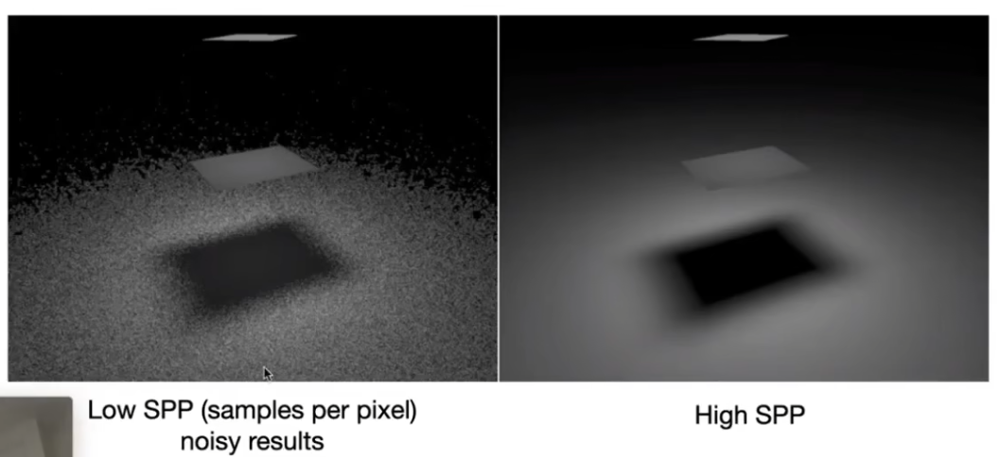
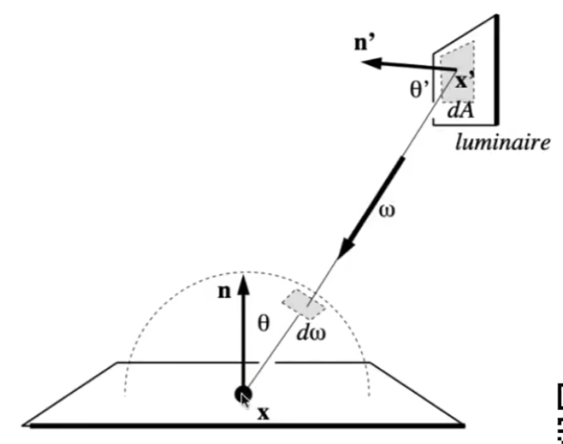
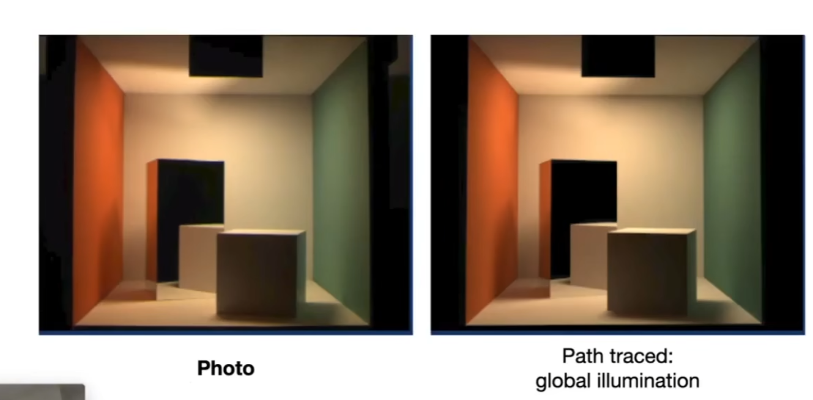

## 前言

[GAMES101-16](https://www.bilibili.com/video/BV1X7411F744/?p=16):蒙特卡罗积分、路径追踪 <!-- more -->

## 蒙特卡罗积分

数学中将随机采样来求解问题的算法统称统称为蒙特卡罗方法，如果应用在积分上就是蒙特卡罗积分。在高数中，我们采取的是求不定积分的原函数在 a,b 的差的方法来积分，但是现在我们不关心原函数又或者说求原函数过于复杂，这种时候蒙特卡罗方法就很有用了。

蒙特卡罗积分的思想如下：对于每次采样 $x_i$ ，求得 $f(x_i)$。以该值估算积分：$\int^a_b f(x)=f(x_i)(a-b)$，随机取 N 个点进行 N 次估算取平均值，则有：

$$\int^a_b f(x)=\frac{1}{N}\sum \frac{f(x_i)}{p(x_i)}$$

其中 $p(x_i)$ 是取到该点的概率密度。这就是蒙特卡罗积分的公式，这里我们只需要关心采样方法的概率密度函数就可以积分了。

> 一个点的概率密度就是在该点附近的面积占整个概率函数的面积。如果均匀取点，就有 $p(x_i) = \frac{1}{a-b}$，那么式子就变成熟悉的 $\frac{1}{N}\sum f(x)p(x)$ 了。

## 路径追踪 Path Tracing

Whitted-Style 光线追踪对光线如下处理：

- 如果是光滑面的镜面反射/折射，就进行光线追踪；
- 如果是漫反射，就停止追踪；

**而这两种处理都是存在问题的**。

- 对于镜面反射，并不是只有能映出影像的镜面，也有抛光（Glossy）面只有高光没有清晰倒影的情况。这也就是说，这种模糊的镜面反射的反射区间比镜面反射略大。
  
- 对于漫反射面，其事实上也能产生反射效果。下图左侧展示了不考虑漫反射出的光的后果（天花板与两个立方体侧面），右侧则展现了考略的后果。
  
  > 上一节的辐射度量学已经指出漫反射将光向四面八方折射的情况

这也正是通过辐射度量学来构建光线追踪的意义所在。

### 逐步推出路径追踪算法

接下来考虑一个简单场景中的情况：场景中有一个面光源、几个遮挡物体与待渲染点。在这个不自发光的点有

$$L_r(p,\omega_r)=\int_{H^2}f_r(p,\omega_i\rarr \omega_r)L(p,\omega_i)\cos\theta_i\mathrm{d}\omega_i$$

应用蒙特卡罗方法进行积分，均匀在半球面上进行采样：

$$
L_r(p,\omega_r)=\int_{\Omega^+}f(x)\mathrm{d}\omega_i
\approx \frac{1}{N}\sum^N_{i=1}\frac{f(x)}{p(\omega_i)}
\\
p(\omega_i)=\frac{1}{2\pi}
$$

也就是说，在该点向外随机选择 N 个方向进行采样，如果该方向遇见一个光源，则着色结果加上该方向经过蒙特卡洛积分后的结果，就得到该点的*直接光渲染*结果。

如果发出射线的方向（$\omega_i$）遇见的是物体，那么我们就将该物体往渲染点方向（$-\omega_i$）反射的光视为光源的光进行着色，这样得到的就是*全局光照*。

这种算法的名字叫**分布式光线追踪**，这种算法并没有错，但是显然，只需要数次折射，追踪的光线的数量就会指数级增长（折射 k 次，则有 $N^k$）条光路。这使得这种算法并不实用。

人们对这个问题的解决办法非常简单粗暴：如果每个着色点只有一个采样方向（N = 1），那么折射多少次都不会发生指数爆炸。这样的一个经过多次折射形成的线路就是一个*路径*。至于噪声问题，则用在一个像素上发出多条路径并取平均的方式进行解决。这就是**路径追踪**。

路径递归的终止条件被称为俄罗斯轮盘赌方法（Russian Roulette，RR）。即类似于俄罗斯轮盘赌，我们取定一个概率 P，每次只有 P 的概率返回值 $\frac{L_o}{P}$ ，而 （1-P） 的概率返回 0。这样，返回值的期望不变，但是光线不能无限次的折射下去。

此时，我们的算法如下：

这是一个**正确的路径追踪算法**了，唯一的问题在于不够高效，低采样率的情况下效果并不好。

造成这种问题的原因在于我们采取了所有方向随机采样的采样方式，低采样率时到光源的方向的可能性低。

### 在光源采样的高效路径追踪

既然我们想采样到打到光源的路径，那么直接在光源上采样不就好了吗？

此时，由于我们是在光源上采样，那么也就需要在光源上进行积分，因此需要将渲染方程改写到光源上。设想场景如下：

在光源上进行平均采样，则概率密度是 $\frac{1}{A}$。将立体角换到光源的立体角上有

$$
\mathrm{d}\omega = \frac{\mathrm{d}A\cos\theta'}{\|x'-x\|^2}
$$

于是（在不被遮挡的时候）

$$
L_r(p,\omega_r)=\int_{H^2}f_r(p,\omega_i\rarr \omega_r)L(p,\omega_i)\frac{\mathrm{d}A\cos\theta'}{\|x'-x\|^2}\mathrm{d}A
$$

不过这只是对光源情况的特殊考虑，对于间接光我们还是采用之前的算法并依然采用俄罗斯轮盘赌的算法，所以这时的算法形如 ：

> 路径追踪是很难处理点光源的情况的，我们可以把它做成很小的面光源

路径追踪是几乎 100% 正确的一种算法，其效果和照片几乎一致：

## 一些眺望：SideNotes

- 现代光线追踪的定义：不止于 Whitted-Style 光线追踪
  以前，光线追踪仅仅指 Whitted-Style，现在，这个词还可以指各类光线传播的算法，例如（单向、双向）路径追踪、VCM/UPBP、光子映射（Photon Mapping）……
- 如何均匀地半球面上采样：本课不涉及
- 如何在蒙特卡洛积分中选择最佳的概率密度函数：拓展至“重要性采样理论”
- RR 中随机数的生成方式很重要：Low Discrepancy Sequences （[低差异序列/拟随机序列](https://en.wikipedia.org/wiki/Low-discrepancy_sequence)， 一种均匀分布随机数的替代序列）
- 结合着色点半球面与光源上的采样方法：可行，MIS（Multiple Importance Sampling） 理论
- 考虑对一个像素的多个路径进行加权处理
- 路径追踪得到的最后 **Radiance 不是着色结果，也和着色结果没有线性对应关系**。
  - 色彩空间、伽马校正……

## 跳转

Home:[GAMES101-1：课程总览与笔记导航](GAMES10101.html)

Prev:[GAMES101-14&15：辐射度量学](GAMES10113.html)

Next：[GAMES101-17：基于物理的材质（BRDF）](GAMES10115.html)
