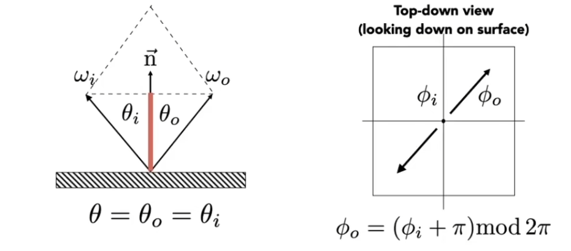

## 前言

[GAMES101-17](https://www.bilibili.com/video/BV1X7411F744/?p=17):各种各样的材质、反射率、斯涅耳定律与全反射现象、菲涅尔项、微表面材质、BRDF 的特点与测量 <!-- more -->

## 材质就是 BRDF

我们现在已经知道，决定模型的光照效果是什么样的是不同的**材质**，而在我们的渲染方程(不考虑自发光)中，和物体自身相关的项只有 BRDF。这就是说， 材质就是 BRDF。

 $$L_r(p,\omega_o)=\int_{H^2}L_i(p,\omega_i) f_r(p,\omega_i, \omega_o) (\vec{n}\cdot\vec{\omega_i}) \mathrm{d}\omega_i$$

> 材质决定物体的光照效果，具体来说，即反射/折射系数、金属质感强弱、光滑感、柔软度等等；
>
> 纹理决定了物体的颜色，从物理上来说即吸收了不同波长的光，纹理的本质是一张图片（uv 图）；
>
> 纹理和材质是关系密切的因为它们事实上在渲染公式中的同一项。但是我们通常不会对一束光分成 RGB  三色进行考虑，所以就有了纹理图的需求。当然，准确地说，材质是只和漫反射系数有关的。

材质多种多样，除了漫反射和镜面反射，这里还介绍两种情况。

- **抛光（Glossy）材质**：这种材质像打磨过的金属面，光被反射到一个小区间里，于是既有高光又不是完全的镜面。不同的金属的抛光面也有不同的质感，例如铜面发红，铝面发白。
- **折射**：半透明类型的材质还会同时发生反射和折射。折射的光与物体内的物体发生反射于是我们就可以看到物体内的物体。如果折射的过程中光被吸收了一部分，我们则就会看到发生折射的物体的颜色。（例如水的绿色）。

### 漫反射与反射率

下面计算**反射率**。

假设一个完全不吸收光(纯白)的物体表面发生漫反射，就有对任意方向来的光都有 $L_o=L_i$， 此时，光均匀地从各个方向来又被均匀的反射到各个方向去，物体本身不吸收任何能量。有：
$$\begin{align}
L_r(p,\omega_o)
    &=\int_{H^2}L_i f_r (\vec{n}\cdot\vec{\omega_i}) \mathrm{d}\omega_i  \nonumber\\\nonumber\\\nonumber
    &= f_r L_i \int_{H^2}\cos\theta_i \mathrm{d}\omega_i    \\\nonumber\\\nonumber
    &= \pi f_r L_i \\\nonumber\\\nonumber
    &\dArr \\\nonumber\\\nonumber
f_r &= \frac{1}{\pi}
\end{align}
$$

定义物体的**反射率(albedo)**衡量物体反射的强弱，值介于 0 到 1 之间，则由上式知道反射率和 BRDF 之间的关系是：
$$
f_r = \frac{\rho}{\pi}
$$

而我们的情境就是物体反射率最强的时候，这时物体纯白。

*Albedo 的定义方式多种多样，既可以是一个数，也可以是 RGB 三个数或一个光图。而 Albedo 纹理是一种特殊的纹理，它用于指定物体表面的颜色或基础反射率。*

## 反射和折射

此外，半透明类型的材质还会同时发生反射和折射。折射的具体效果见上。

类比于 BRDF，对于折射的 “BRDF” 就是 BTDF，二者可以合称 BSDF。

### 反射

对于反射，我们知道入射角等于反射角。有两种计算反射方位的方式。

1. 利用向量的性质，入射向量加出射向量与法线向量共线(左图)
   $$
   \omega_i+\omega_o=2\cos \theta\vec{n} = 2(\omega_i\cdot\vec{n})\vec{n}\\
   \rArr \omega_o = -\omega_i+ 2(\omega_i\cdot\vec{n})\vec{n}
   $$
2. 类似在立体角处的讨论，把角度分成与法线方向的夹角 $\omega$ 以及垂直俯视法线方向的平面上的角 $\phi$ （右图），则 $\omega$ 不变，只需
   $$\phi_o=(\phi_i+\pi)\mod2\pi$$

> 镜面反射还需要涉及到狄拉克 δ 函数，这里没有展开。

### 折射

斯涅耳定律（Snell's Law）指出，光从环境 i 打到环境 t 中，折射率与折射角（于法线轴夹角）度满足：
$$
\eta_i\sin\theta_i = \eta_t\sin\theta_t
$$

其中，真空的折射率为 1。而折射率越高，往法线方向（的负方向）偏移就越多。

> 折射在垂直于法线的平面上不改变光的方向。

由斯涅耳定律推出

$$\begin{align}
\cos\theta_t
    &=\sqrt{1-\sin^2 \theta_t}\\\nonumber\\\nonumber
    &=\sqrt{1-(\frac{\eta_i}{\eta_t})^2 (1 - \cos^2 \theta_i)}     \\\nonumber\\\nonumber
    &\dArr \\\nonumber\\\nonumber
    &1-(\frac{\eta_i}{\eta_t})^2 (1 - \cos^2 \theta_i) \nless 0
\end{align}
$$

这意味着当入射介质的折射率大于出射介质折射率的情况下，有可能不会发生折射，这就是全反射现象。

> Snell's Window
>
> 如果大折射率介质中看小折射率介质，我们只能看到有限的一个区域，这是因为其他较远的入射较大的入射角让光无法折射到人眼处了已经。这种情况就是 Snell's Window。

### 菲涅尔项

日常生活中可以观察到的现象：如果俯视一张光滑的桌子，几乎没有反光现象；如果接近平视，则发光现象明显。这说明，**物体的反射折射率于光的入射角度有关**，这可以用菲涅尔项描述。

简单地说，菲涅尔项告诉我们：

1. 如果和法线方向夹角越大（最多90度到平面），反射率越高，甚至于几乎全部反射掉；如果夹角越小，则反射率也越小，**最小值不为零**。
2. 不同物体有不同的菲涅尔项。
3. 导体（金属）和绝缘体的菲涅尔项图像大不一样，主要体现在金属的最小反射率非常高，例如 0.9。

菲涅尔项的计算公式较为复杂，因此我们通常使用近似公式（施里克近似，Shilick's Approximation）

$$
R(\theta)=R_0+(1-R_0)(1-\cos\theta)^5\\
R_0=(\frac{n_1-n_2}{n_1+n_2})^2
$$

其中 $R_0$ 是最低反射率。

> 拓展，导体的反射率还会发生随着角度增大而在一定区域内发生降低。此外，导体的折射率是负数。

### 微表面材质

从太空看地球我们可以发现这样一个事情，我们看不见地球表面的山川地貌，而看得阳光在地球表面的山川各种作用后的整体光照情况。

微表面理论告诉我们，离得够远，就看不到物体表面细节但是可以看到整体的光照情况。

于是微表面材质：

- 宏观：平坦但粗糙
- 微观：崎岖的几何面且镜面反射，有自己的独立法线。

如果表面相对光滑，微表面反射的光集中在一个较小的区间，呈现抛光的效果；如果表面相对粗糙，微表面反射的光分散在一个较大的区间，呈现漫反射的效果。

微表面的 BRDF：

$$
f(i,o)=\frac{F(i,h)G(i,o,h)D(h)}{4(n,i)(n,o)}
$$

其中

- h：中间向量方向，即入射与出射方向的中间方向；
- F：菲涅尔项，告诉我们当前角度的反射率；
- G：几何项/ Shadowing-masking term，告诉我们有多少微表面的反射被另外一个微表面遮挡而损失了。这可以修正在接近水平面时的过亮情况；
- D：查询微表面反射的方向和中间向量的位置关系；

## 各向同性材质与各项异性

- 各向同性：微表面没有非常明确的方向性；或者从 BRDF 的方向来说，入射角和出射角的方位角变化，但是相对角度不变，则光照效果不变。
- 各向异性：微表面有非常明确的方向性；从 BRDF 的方向来说，入射角和出射角的方位角变化，但是相对角度不变，光照效果会变。

> 各项异性的一个例子,沿一个表面刷过的金属器皿有条状/辐射状的高光。

这里的各项异性和我们前面提到的各项异性过滤是一样的内涵。

## BRDF 的特性

总结 BRDF 的特点

- 非负性：能量的分布当然不可能是负数
- 线性：我们可以把 BRDF 拆分计算再相加（Blinn-Phong 中高光、漫反射、全局的处理）
- 可逆性：交换入射出射结果不变
- 能量吸收：BRDF积出来结果不会变多
- 如果各项同性，BRDF 只有三个维度（$\theta_i-\theta_o,\phi_i,\phi_o$），而不是四个。而且可逆导致第一项只用考虑绝对值。

## BRDF 的测量

实际上的 BRDF 非常复杂，所以我们可以（要）测量 BRDF，而不是（不能）仅简单使用公式。

测量方法：可以枚举所有的光照方向和观察方向。

当然，如果各向同性可以砍一个维度。

> 拓展：MERL BRDF Database

## 跳转

Home：[GAMES101-1：课程总览与笔记导航](GAMES10101.html)

Prev：[GAMES101-16：辐射度量学与路径追踪](GAMES10114.html)

Next：[GAMES101-18：渲染中的高级板块](GAMES10116.html)
