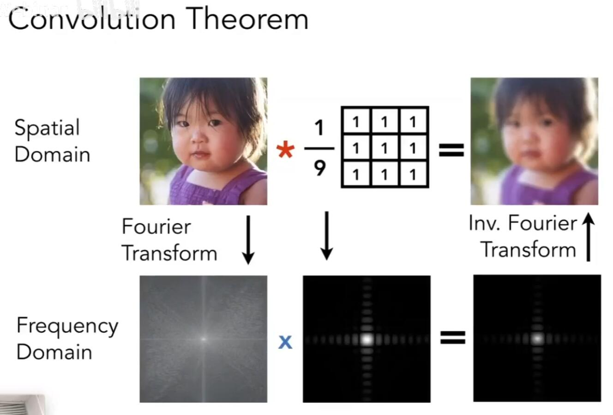
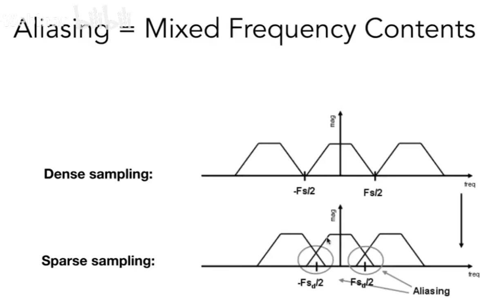

## 前言

[GAMES101-P6](https://www.bilibili.com/video/BV1X7411F744?p=6)：反走样<!-- more -->

## 走样现象

瑕疵（Artifact）：图形学中的一切错误、误差、不准确等。

经过**采样**以后，会看到明显的锯齿边缘，这是一种走样现象。

常见的走样现象：锯齿、摩尔纹、频闪效应

> 走样不仅可以发生在空间中，时间上也可以走样。例如频闪效应。

采样现象产生的原因：信号变化的频率对于采样频率而言高。（奈奎斯特定理）

> 采样频率高于信号频率两倍，才能完全恢复信息。

## 傅里叶变换

傅里叶变换：任何函数可以可以用一系列的基本三角函数的组合表示。

通过傅里叶变换我们可以将图像由时域迁移到频域。并且可以发现，对于大部分正常的图像，大部分信息集中在低频，高频信息很少。

我们应用滤波：

- 高通滤波：我们忽略掉低频信息，只保留高频信息，那么就能得到图像的边界（像素迅速变化的地方）。
- 低通滤波：我们忽略掉高频信息，只保留低频信息。那么就能得到模糊的图像。
- 保留区间内频率：一些不太明显的边界（太明显的当然是非常高频的信息）。

我们可以认为：滤波=卷积=平均（卷积的概念见维基）

卷积定理：时域上两个信号的卷积等价于频域上它们信号的乘积。

越大的卷积盒会保留越低的频率，带来越模糊的图像。

从频谱的角度理解采样：

- 采样就是在不同的频域上复制原有的频谱
- 采样率不够高，那么不同频域上的频谱就会混叠在一起

## 反走样的办法

- 增加采样率：简单暴力，直接提高采样率。
- Pre-Filter：预先滤波。首先用滤波对原图进行模糊，这样边缘有的像素就会点上介乎于边界两边的中间色，例如更浅的颜色。
    > 滤波必须在采样之前进行,否则得到的是模糊的锯齿(Blurred aliasing)，没有很好的反走样效果。
    >
    > 因为真实边界信息在采样过程中已经损失了，所以滤波只能平均/模糊错误的信息。

    从频率的角度来理解，滤波的作用是削去了高频信号，这样就占用的频率带宽变小，原本会混叠的信号就不会混叠了

    
- MSAA：对一个像素内设置更多的采样点。例如四个角各有一个像素点，如果只有 x 个点被覆盖就是 x/4 的灰度。
  > MSAA 并没有提高分辨率，只是提高了一个像素内的采样数量。

  当然，MSAA 会显著提高计算量，不过当代工业界会通过复用像素等方法来降低消耗。4x MSAA 并不会让游戏帧率降低到 1/4。
- FXAA（Fast Approxim AA）：不对图像而对图片进行处理。得到图像以后，图像匹配找到有锯齿的边界，用没有锯齿的边界进行替换。  
- TAA：复用上一帧的结果。

## 跳转

Home：[GAMES101-1：课程总览与笔记导航](GAMES10101.html)

Prev：[GAMES101-5：(三角形的)光栅化](GAMES10105.html)

Next：[GAMES101-6(2)：深度检测与 Z-buffer 算法](GAMES1010602.html)
