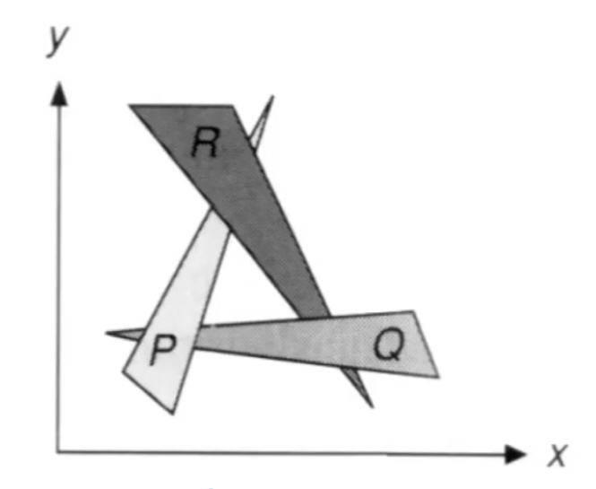

## 前言

[GAMES101-P7](https://www.bilibili.com/video/BV1X7411F744?p=7)：可见性问题：画家算法和 Z buffer 算法<!-- more -->

场景中的不同远近的物体存在遮挡关系，我们需要根据深度（z 轴值）得出正确的遮挡关系。

## 画家算法：由油画家启发的算法

画家算法的思路：类似于油画画家的作画思路：画家先画最远的面，再画较近的面，最后画最近的面，就能得到完整的画面。

> 画家算法的做法：先对每个面进行深度排序，然后按远近顺序进行作画覆盖。
>
> 由于排序算法的时间复杂度最快是 $O(n \log n)$, 因此画家算法至少会有这么多的时间复杂度

画家算法能得到一些正确的结果，但是不能保证一直正确，例如一个面上所有的点的深度不一致、循环遮挡等情况。下面是一个画家算法无法处理的情况


## Z-Buffer 算法：深度缓冲算法

我们已经维护了一个帧缓存（frame buffer），其存储的每个单元就是屏幕显示的每个像素的颜色。我们现在再维护一个深度缓存（depth buffer/Z-buffer），存储当前像素点的深度信息。

一开始所有深度都为无穷大，每次放入一个面，就对其覆盖的像素检查深度值。深度浅于当前深度时，才会对应更新此像素点对应的深度值和颜色值。

伪代码：

```c#
foreach T in triangles
    foreach pixel[x,y,z] in T
        if(z > zBuffer[x,y])
            frameBuffer[x,y] = pixel[x,y,z]; // update color
            zBuffer[x,y]     = z;            // update depth
        else 
            do nonthing;
```

Z buffer 的**优点**在于，Z buffer 不需要考虑到遍历的顺序问题，得到的结果总是正确的。而且速度优于画家算法：Z buffer 的时间复杂度可以认为是 $O(n)$ 的，因为我们并没有进行排序，而只进行了遍历。

> 请注意：
>
> 1. 我们没有考虑深度一致的问题
> 2. Z-buffer 无法处理透明效果
> 3. 如果我们将 Z-buffer 与 MSAA 结合，那么对像素的处理就要对应变为对采样点的处理。
> 4. Z-buffer 是当前广泛采用的算法

## 跳转

Home:[GAMES101-1：课程总览与笔记导航](GAMES10101.html)

Prev:[GAMES101-6(1)：反走样](GAMES1010601.html)

Next：[GAMES101-7&8：着色、纹理与图形管线](GAMES10107.html)
