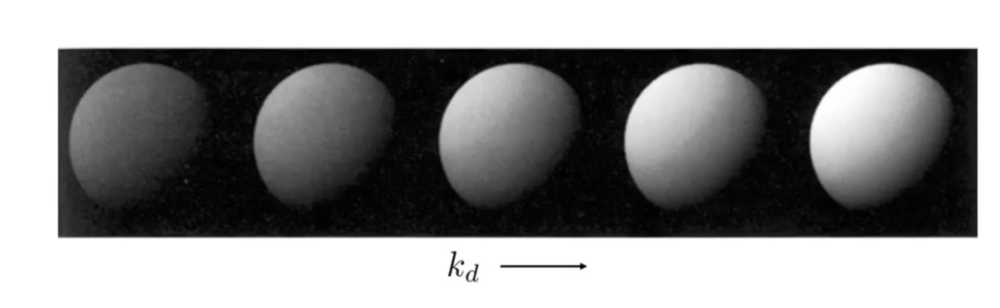
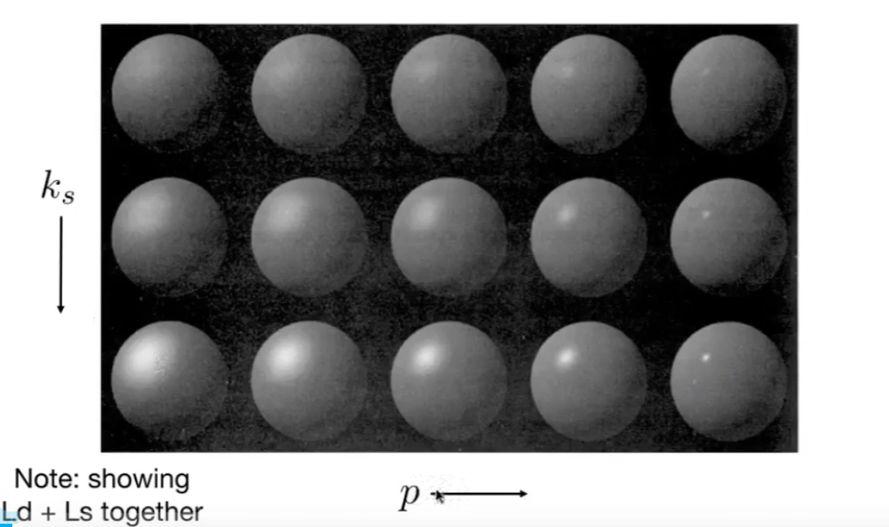
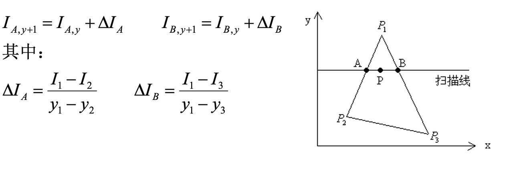
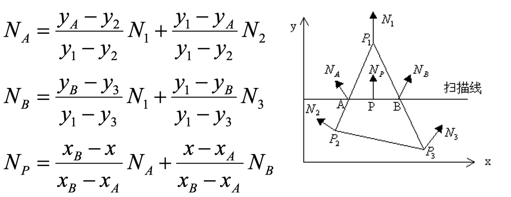
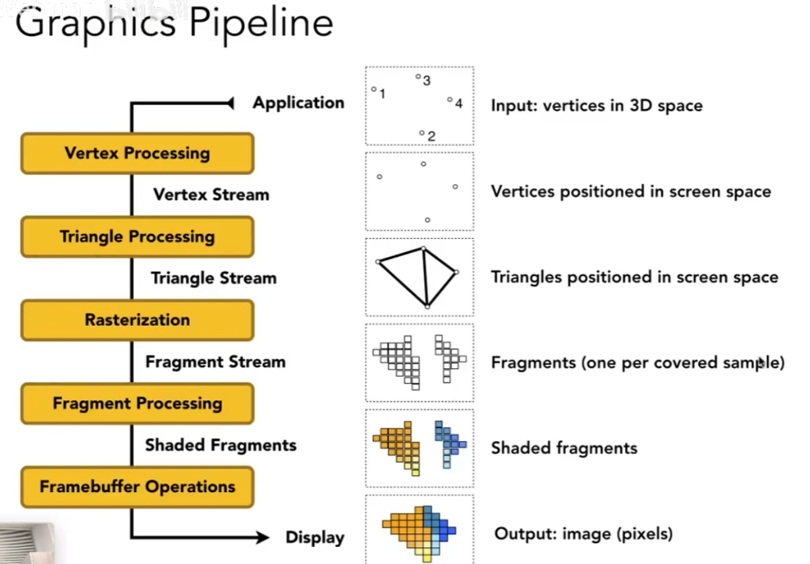

## 前言

[GAMES101-7](https://www.bilibili.com/video/BV1X7411F744/?p=7)、[GAMES101-8](https://www.bilibili.com/video/BV1X7411F744/?p=8):着色（Shading）、Blinn-Phong 着色模型、着色频率、纹理映射、图形管线 <!-- more -->

仅仅进行光栅化是不够的。想象一个纯色的方块，将它放在空间中，如果四面的颜色是一致，那么我们反而会觉得不够真实。因为我们期待会有明暗变化。也就是 Shading。

> **注**：从本节开始，所引用的图片既有来源于 GAMES101 课程截图，亦有来源于西安电子科技大学《计算机图形学》课程的课件。

## 着色

Shade 指的是对物体对阳光遮挡产生的阴影。在绘画领域（例如素描）中，绘画者使用不同浓淡、疏密的墨水/线条来表现光线的明暗变化，这样的过程被叫做 Shading。在计算机图形学领域，Shading 基本上做的依然是这种工作，即根据表面和光线等条件确定表面的颜色。

> shade 不等于 shadow，我们在这里只关注物体本身的明暗变化，不关心阴影的产生

### 定义一些概念

定义下面这么一些概念

- 着色点 p
  - 着色点 p 的性质，例如颜色、闪亮程度（反光）
- 法线向量 n：垂直于 p 局部表面指向外面
- 观察者方向 v：从 p 指向观察的眼睛的方向
- 光线方向 l：从 p 指向光源的方向

### Blinn-Phong 反射模型

模型将光分为三种：

1. 高光区域：被光直接打到发生镜面发射的区域
2. 漫反射区域：被光直接打到发生漫发射的区域
3. 环境光区域：没有直接被光打到但是被其他地方反射出来的光照亮的区域

下面依次讨论

#### 漫反射公式

我们认为漫反射会把光均匀的反射给所有的方向。此时，影响 shading 的因素是

- 这个局部平面接受到了多少来的光
- 接收到的光有多强
- 物体反射光的强度：我们知道物体表面会吸收一些光反射一些光

一个表面对于一束光线能接收到多少我们认为取决于法线方向与光线方向的夹角余弦值 $\cos \theta = \vec{n}\cdot\vec{l}$。

如果我们已经知道点光源向所有方向散发出的光强总共是 $I$，那么在距离点光源 $r$ 的位置，总共 $I$ 的光的强度（能量）散布在以 $r$ 为半径的球上。球上任意一点的光强就是$\frac{I}{r^2}$

于是得到如下漫反射着色公式

$$L_d=k_d\frac{I}{r^2}max(0,\vec{n}\cdot\vec{l})$$

其中，max 函数的作用是丢弃从法线方向的反方向传过来的光线，$k_d$ 是反射系数。

> 如果定义表面对 RGB 三色的不同反射系数，也就定义了表面对不同光的吸收程度。换言之，定义了物体表面的颜色。

下面是光源和位置不变时，不同 $k_d$ 对物体表现的影响。

注意，漫反射意味着从任何方向看亮度都是一致的，这个定义没有暗示漫反射区域的亮暗。

#### 高光公式

高光区域接近于产生镜面反射，我们只有在接近反射方向的时候才能看见明亮的光。

求光源方向 $l$ 关于 $n$ 对称的 $l'$ 与观察方向 $v$ 的接近程度比较不方便。衡量观察方向是否接近采用的方法如下：

1. 求 $l$ 和 $v$ 的角平分线方向上的向量（半程向量）$h$：由于 $l$ 和 $v$ 都是单位向量，因此很方便地有
   $$\vec{h} = \frac{\vec{v}+\vec{l}}{||\vec{v}+\vec{l}||}$$
2. 计算 $\vec{h}$ 和 $\vec{n}$ 的余弦值 $\cos \alpha$

于是得到如下高光着色公式

$$L_s=k_s\frac{I}{r^2}max(0,\vec{n}\cdot\vec{h})^p$$

其中指数 p 是控制高光大小的，即定义多接近反射方向算“接近”。通常取值在 100~200

下图展示了 cos 函数随指数的变化

下图展示了系数对高光的影响

#### 环境光公式

环境光在不同的物体之间来回反射，我们简单地认为环境光是一个常量。公式为

$$L_a = k_aI_a$$

> $I_a$ 是环境光的强度，$L_a$ 是环境光在物体表面造成的亮度

### 着色频率

前面讨论的模型是针对一个着色点进行的，**着色频率**即选取着色点的疏密。

有三种着色的方式，它们有不同的着色频率：

1. Flat 着色：对一个面选取一个着色点，以该着色点的结果对整个面着色；
2. Gouraud 着色：把每个顶点视为着色点，面内部的颜色使用线性插值得到；下面是计算插值的两种方式：
   1. 直接插值
    
   2. 增量法：利用前一步的计算结果加上增量得到当前的结果
      1. 当扫描线增加一个单位变为 $y+1$，对线上的点A、B
        
      2.当逐个处理非线上的点，$x$ 变为 $x+1$
        

3. Phong 着色：对面上的每一个像素点都进行着色，这些面内的着色点的法线方向是根据顶点法线方向插值得到。法线方向插值公式如下：
   

通常地说，Flat 着色（均匀着色）的着色结果最不准确；Gouraud 着色更加精细，但是也会有高光错误的问题；Phong 模型在三者中最精细但是计算量也远大于前二者。但是这种区别不是绝对的，随着技术的进步，如今模型的面数越来越多。而在面够多够小的情况下，Gouraud 甚至 Flat  也能取得不错的效果，当然，这种情况下由于面太多，它们的计算量也会升高。

> 如果面数多余像素数，那么 flat shading 的着色频率甚至比 phong shading 还高

#### 点的法线向量的求法

数学告诉我们面的法线向量的求法（利用法线与所有面内向量垂直的特性），对于每个顶点，我们定义它的法线向量是它邻接的面的法线向量的（加权）平均：

$$N_v =  \frac{\sum_iN_i}{\|\sum_iN_i\|}$$

使用面积进行加权则：

$$N_v =  \frac{\sum_iS_iN_i}{\|\sum_iS_iN_i\|}$$

面内像素法线求法见上面 Phong 着色部分

## 图形管线（实时渲染管线）

简单地说，渲染管线就是将从 MVP 变换至今的所有流程组合在一起的过程（类似流水线的概念）

简要解读，步骤如下：

1. 顶点处理： MVP 变换、顶点着色；
2. 三角形处理：屏幕空间中的点生成三角形；
   > 只要知道点和点之间的关系，我们没有必要对边进行 MVP，对点进行就够了
3. 光栅化：打散成 fragment：每个 fragment 通常对应一个像素，但是如果应用 MSAA 等，那么多个也就 fragment 才能对应一个像素了；
4. fragment 处理：对 fragment 进行深度检测、（可见的像素）着色；
5. 帧缓存操作：放入缓存（buffer）中输出。

### 着色与着色器（Shader）

着色有两个可以发生的步骤，一是顶点处理时的顶点着色 Gouraud 着色，一是片段（fragment）处理时的 Phong 着色。

进行着色处理的代码就是着色器（Shader）。根据着色方式的不同，也就分为顶点着色器和像素/片段着色器。可编程 Shader 即我们自己编写一段逻辑操作硬件进行着色处理，这种逻辑会对每一个顶点/片段应用一次。

> Shader 逻辑决定了像素颜色应该是什么。

一个可以写和探索 Shader 的网站:[shadertoy](https://shadertoy.com)

## 纹理映射（Texture Mapping）

在应用同一个模型同一个着色方案的时候，这些模型有相同的高光区域和漫反射，这就是材质。但是，我们依然希望一个物体表面上不同的点有不同区别，例如颜色。换言之我们需要一种对模型表面每个点的不同属性的表达方式，这即是纹理。

> 以 blinn-phong 公式为例 $L_d=k_d\frac{I}{r^2}max(0,\vec{n}\cdot\vec{l})$，我们可以认为纹理就是决定了每个点 $k_d$ 这一部分的取值应该是多少。

如果我们将一个模型表面展开，那么所有点都可以在一个平面上表示。因此我们用一个平面图（纹理图）存储点的属性，再将纹理图的点投射对应到物体表面上的点，那么模型就有了纹理。这就是纹理映射。

纹理图上点的坐标使用（u,v）表示。因此 uv 图即纹理坐标图。我们规定 u，v 的取值范围均为 $[0,1]$ ，但是并不要求 uv 图必须是正方形。可视化时，我们还可以将 u 方向大用偏红，v 方向大用偏绿进行表示。

> 注意：没有规定一个模型的表面和 uv 图的点是一一对应的，一个 uv 坐标完全可以对应多个模型点坐标

## 跳转

Home：[GAMES101-1：课程总览与笔记导航](GAMES10101.html)

Prev：[GAMES101-6(2)：深度检测与 Z-buffer 算法](GAMES1010602.html)

Next：[GAMES101-9&10：纹理映射的具体内容](GAMES10108.html)
