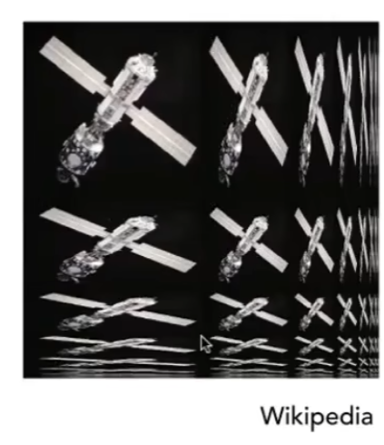

## 前言

[GAMES101-9](https://www.bilibili.com/video/BV1X7411F744/?p=9):重心坐标、映射办法、纹理应用。

[GAMES101-10](https://www.bilibili.com/video/BV1X7411F744/?p=10):纹理应用。 <!-- more -->

## 插值与重心坐标系

Gouraud 和 Phong 着色模型都要求在三角形内部插值，只是插值的不同，为了解决这个问题，我们应用重心坐标系。

对于任意三角形 $\triangle ABC$ 所在平面内点 P 有：

$$ P(x,y) = \alpha A + \beta B + \gamma C \\\alpha+\beta+\gamma=1 $$

**当点在三角形内，则 $\alpha\ \beta\ \gamma$ 均为非负数**。

这就是**重心坐标系**，通过重心坐标系，我们可以将三角形内的点坐标写成 $(\alpha,\beta,\gamma)$ 的形式。

已知 P 点的坐标，求重心坐标的办法如下：

1. 连接 PA、PB、PC，把 $\triangle ABC$ 分成三个小三角形 $\triangle ABP$、$\triangle APC$、$\triangle PBC$。
2. 定义一个顶点对应的小三角形是与它不相邻的小三角形。如 A 对应 $\triangle PBC$
3. 定义三角形面积为 $S$
4. 由于三角面积$S=\frac{1}{2}l\cdot h=\frac{1}{2}|\vec{a}||\vec{b}|\sin\theta=\frac{1}{2}|\vec{a}\times \vec{b}|$，有：
   $$
   \alpha=\frac{S_{\triangle A}}{S}=\frac{\vec{BP}\times\vec{BC}}{\vec{BA}\times\vec{BC}}\\
   \beta=\frac{S_{\triangle B}}{S}=\frac{\vec{AP}\times\vec{AC}}{\vec{BA}\times\vec{BC}}\\
   \gamma=\frac{S_{\triangle C}}{S}=1-\alpha-\beta\\
   $$

> 当 $\alpha\ \beta\ \gamma$ 均为 $\frac{1}{3}$ 时，该点就是三角形的重心。重心将三角形分为三个面积相等的小三角形。

写成坐标就是：

$$\alpha=\frac{(y-y_B)(x_C-x_B)-(x-x_B)(y_C-y_B)}{(y_A-y_B)(x_C-x_B)-(x_A-x_B)(y_C-y_B)}$$

> 这个公式没啥记忆的必要，知道向量形式公式咋来就行。

此外还需要**注意**，由于重心坐标没有投影不变性，因此插值应该在投影前完成而非投影后。

## 纹理映射

下面是一个简单的纹理映射逻辑：

1. 我们已经知道了每个顶点对应的uv坐标是什么
2. 对于每个像素/屏幕采样点的坐标
    1. 插值得到 uv 坐标
    2. 查询 uv 坐标对应的值 texcolor
    3. 像素的“颜色”（通常来说，漫反射系数）就设为 texcolor。

### 纹理放大带来的问题

如果纹理太小，分辨率太高，那么就相当于放大了纹理，每个像素求得的 uv 坐标将是小数。此时查询 uv 坐标的 texcolor 我们可以这么做：

1. 对非整数的 uv 坐标直接取整：会导致多个连续像素对应同一个纹素（texel），导致马赛克。
2. 双线性插值：综合考虑上下左右四个纹素的远近关系进行插值，像素过渡更自然连续。
3. 双三次插值：综合考虑最近 16 个纹素的远近关系进行插值，像素过渡更自然连续，但是开销也比双线性更大。

### 纹理过小带来的问题

如果纹理太细小，那么一个像素对应太大的纹理区域，那么直接采样带来的结果和之前光栅化采样类似，采样频率过于稀疏，导致走样，产生摩尔纹锯齿等现象。**超采样**能解决问题，但是开销巨大，其他的一些解决办法是：

#### Mipmap

Mipmap 可以进行快速、近似、方形的一个范围内的平均值查询。

Mipmap 的思路是，如果使用范围查询，快速查询像素对应区域内纹素的平均值，那么也就不需要采样（点查询），也就规避了采样的问题了。

> 点查询即给定一个点查询对应点的值，范围查询则要求查询一个范围内的值，具体到此处是平均值。

Mipmap 会对每个图像不断构造分辨率变为原来 $\frac{1}{2}\times\frac{1}{2}$ 后的图像形成层级关系。例如第零层是原图 128×128，那么第一层是 64×64，第二层是 32×32……依此类推。通过数学可以简单地证明这样做带来的开销并不算很大，极限多占用额外的 $\frac{1}{3}$ 空间。

> Mipmap 也就是计算机视觉中的图像金字塔。

对于一个像素，我们求得它的覆盖的正方形面积（通过求它的邻居映射到哪个 uv 坐标取距离中间值或直接取像素四边对映射坐标等等）。根据边长为 L ，它对应的层级是$D = \log_2L$,于是取在该层 mipmap 的值即可。

如果求得层级是非正数，那么直接舍入会带来割裂感。我们可以使用插值的办法解决 1.8 层这样的问题。

**三线性插值**：在下舍的层级进行双线性插值；在上入的层级进行双线性插值，最后对两层结果进行线性插值。

Mipmap 并不是完美的，下图展示了 由于 Mipmap 和三线性插值“平均”的特点导致远处过糊的问题。

#### 各向异性过滤

各向异性过滤对 x 轴、y 轴可以单独压缩，通过这种方式，我们可以解决一个像素对应一个长方形纹理区域的问题，从而带来更好的效果。但是，各向异性过滤不能解决斜向四边形等问题。

> 各项异性过滤的极限是原图储存的三倍，而非三分之一。

## 纹理映射的应用

从 GPU 的角度看：纹理就是一段存在内存中的数据，GPU 可以对其进行点查询或范围查询。由此可以 启发我们对纹理映射的应用。

- 环境光照/环境光映射：记录哪个位置有（直接/间接）光形成纹理图，映射以后就能得到一种类似镜子的、看到周围环境的效果。
- 环境光映射球/立方：我们可以用“一个绝对光滑的球”记录一个环境里所有的光照来源方向。
- 凹凸贴图：定义一个点相对于附近的点的高度改变法线方向结果或者直接定义其法线方向，从而得到橘子皮似的凹凸表现结果。
  首先计算出原来的法线（插值），求其在 uv 方向的偏导数，进而得到其垂直的法线结果，也就是我们要的“假法线”。
- 位移（displace ment）贴图：真的去偏移顶点而不是欺骗眼睛。
  凹凸贴图的缺点是图像的边缘不会真的变得凹凸出现错误，内部的假凹凸也不会在邻近区域产生阴影。
  但是位移贴图要求模型足够细，采样跟得上位移偏移的变化的频率。
- 3D纹理：通过三维噪声生成纹理贴图，达到处处有贴图的效果，即使一个物体被劈开，内部依然可以得到对应的贴图。
- 预计算着色：把着色结果记录在纹理图中。例如眉毛下对眼睛产生的阴影，规避一些影子计算的问题。

## 跳转

Home:[GAMES101-1：课程总览与笔记导航](GAMES10101.html)

Prev:[GAMES101-7&8：着色、纹理与图形管线](GAMES10107.html)

Next：[GAMES101-10&11：隐式几何与显式几何](GAMES10109.html)
