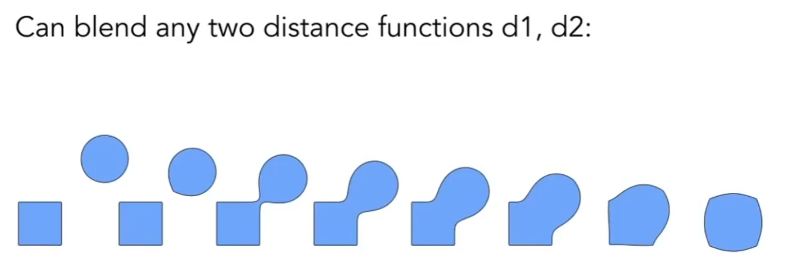

## 前言

[GAMES101-10](https://www.bilibili.com/video/BV1X7411F744/?p=10):隐式几何   <!-- more -->
[GAMES101-11](https://www.bilibili.com/video/BV1X7411F744/?p=11):显式几何

用三角形面并不能很好的面对所有的情形，例如：庞大的城市如何简化远景、狗身上繁复细密的毛发、轻薄半透的纱衣……

CG 中将几何分为隐式几何与显式几何。下面分别讨论。

## 隐式几何

隐式几何：不指明点的位置，但是指明点的关系。例如 $x^2+y^2+z^2=1$。更通用地，隐式几何指明 $f(x,y,z)=0$。

隐式几何很难判断有满足条件的点都有哪些，但是很容易知道指定的一个点是否满足条件（在几何面上）。

在简单的几何情况下，我们容易写出f（x），但是几何体过于复杂时，虽然也可以找到合适的函数（傅里叶？），但是我们可以采用**构造实体几何**（CSG）的办法：

构造实体几何：对基本的隐式几何体进行基本的布尔运算（交并补等）得到复杂的几何（参考工图作业图）。

此外对于隐式几何我们还可以用**距离函数**：

距离函数：对任意一个点定义与几何体的，例如在面上距离为 0，面外为正，面内为负。

通过距离函数我们可以实现两个图形相融合的效果（空间中的点同时受到两个面的距离的拉扯），例如

空间中的一个点在图形 AB 的距离分别是 a，b，那么最后距离为 a+b，最后找出 a+b = 0 的地方就是融合后的新面上的地方。

为了表示好复杂情况下的等距离点的集合，我们应用水平集这个概念表示同一个水平线的点的集合，类似等高线。

如果定义在三维，存储为纹理图，那么我们就可以找到一个有同一特征的面形成纹理。

隐式几何我们还可以很方便的表示**分形图形**。

## 显式几何

显示几何的定义方法是**直接给出**（例如前面章节提到的三角形面）或**参数映射**（例如每个 （u，v）都能映射到一个（x，y，z））。

相对地，显式几何难以判断点是否在几何面上。

显式几何的一些例子：

- 点云：用一堆点表示面，可以表示任何图形，通常会被转化成多边形面。
- 多边形面：用多个三角形面拼接成图形
  - obj格式：一种存储模型的格式，存储用点和点的联系关系。

## 跳转

Home：[GAMES101-1：课程总览与笔记导航](GAMES10101.html)

Prev：[GAMES101-9&10：纹理映射的具体内容](GAMES10108.html)

Next：[GAMES101-11&12：曲线与面](GAMES10110.html)
