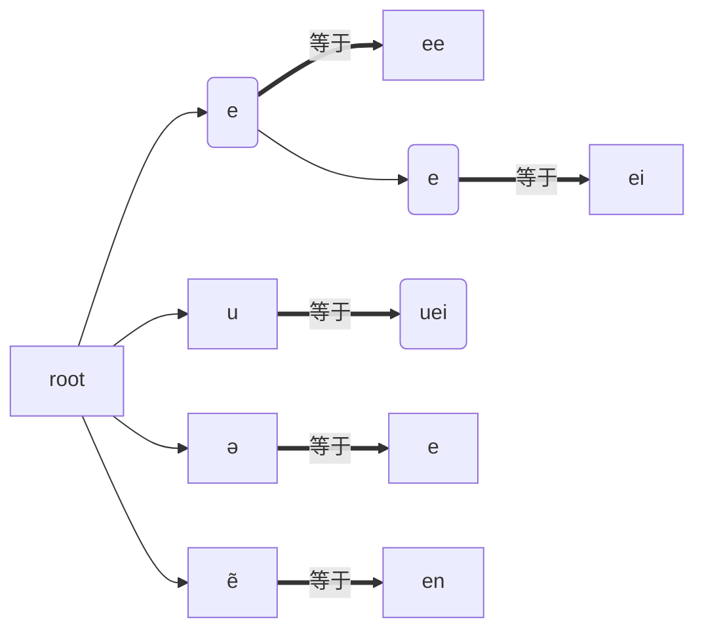

## 前言

在维护网站时，需要执行一次文本替换，然后从 AI 那里注意到了前缀树。 <!-- more -->

## 介绍前缀树

假设我们需要根据下面这个字典执行文本替换：

```json
{
    …
    "e": "ee",
    "ei": "ei",
    "uei": "uei",
    "ə": "e",
    "ẽ": "en",
    …
}
```

由于匹配符可能为匹配符的子串，以及替换符也可能命中另一个匹配符。这时，根据规则依次执行 `replace()` 就很麻烦了，需要仔细考虑各种执行顺序的问题。前缀树就能解决这个问题。

前缀树是一个树结构，对传入的字符串，我们尽力在树中找到最深的情况，并替换为对应的字符串。最后将所有字符的返回结果拼合在一起，就得到最终的结果了。这有点儿像原子性，我们不会停留在某个中间态，只需一个执行就可以得到最终结果。并且，原来的方案中，长度为 n 的字符串匹配 m 个规则，需要 O(n*m) 的时间复杂度，前缀树则只用 O(n) 的时间复杂度。

在执行替换之前，我们需要先将字典转换为前缀树结构：

```typescript
root = new TrieNode()
def build_trie(replacements):
    for key, val in replacements.items():
        node = root
        for char in key: # tree 中的每个结点都是一个字符
            if char not in node.children:# 当前结点没有 char 字符的子结点，开辟新子结点
                node.children[char] = TrieNode()
            node = node.children[char]
        node.value = val 
```

其中，TrieNode 由 `children`(dict) 和 `value`(str)组成。

对于上面的例子，我们会得到如下的树



然后在执行替换的时候，我们也原样依次遍历字符。

```typescript
def get_replacement(text):
    i = 0
    result = []
    while i < len(text):
        node = root
        j = i
        last_val = None
        last_j = i

        while j < len(text) and text[j] in node.children:
            node = node.children[text[j]]
            j += 1
            if node.value is not None:
                last_val = node.value
                last_j = j

        if last_val is not None:# 匹配上，说明 text[i-j]都已经可以跳过了
            result.append(last_val)
            i = last_j 
        else:# 没有匹配上，说明 text[i]需要保持原样
            result.append(text[i])
            i += 1

    return "".join(result)
```

不过，严格来说，上面的算法是不能解决我们的问题的，因为形如 `ẽ` 这样的字符，app在表示的时候，可能是将它拆成了`e+\u0303`的形式，这样就匹配不上了，因为后者不是一个完整的字符。所以我们还要在构建树和查询之前，先将 unicode 字符替换成预合成模式

```typescript
import unicodedata

# Unicode 存在“标准等价”和“兼容等价”
# 每个等价概念又有“完全分解”和“完全合成”两种状态
# 因此一共有四种状态：NFC、NFD、NFKC、NFKD
# 其中 NFC 是标准等价的合成
def normalize_str(s: str) -> str:
    return unicodedata.normalize("NFC", s)
```

## 滑窗

当然，采用下面这样的滑窗算法也是可以的，先手动按长度排序，然后匹配过的字符串就被窗口“滑过”即可。

```typescript
def replace_with_dict(text: str, replacements: dict[str, str], max_key_len: int = 3) -> str:
    i = 0
    res = []

    # 预取下所有可能的 key 长度，避免每次都 max()
    key_lengths = sorted({len(k) for k in replacements.keys()}, reverse=True)

    while i < len(text):
        # 尝试最长的 key
        for L in key_lengths:
            if L == 0:
                continue
            snippet = text[i:i+L]
            if snippet in replacements:
                res.append(replacements[snippet])
                i += L
                break
        else:
            # 没有任何匹配
            res.append(text[i])
            i += 1

    return "".join(res)
```
