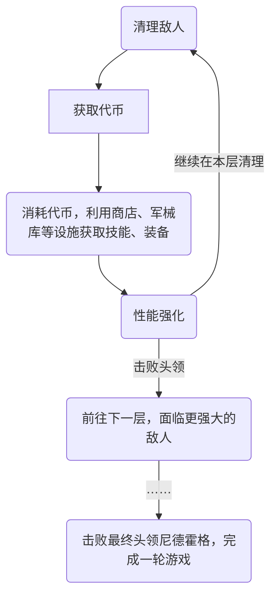

<!-- <!-- markdownlint-disable MD033 --> -->
## 前言

虽然之前也玩过一些肉鸽，但是始终没有通过一部。最近通关了一个买了很久的游戏：《BPM：枪林弹雨》（Bullet Per Minute）~~的容易模式~~，借此机会聊聊这个游戏和我对肉鸽的一些感受。 <!-- more -->

<iframe src="https://store.steampowered.com/widget/1286350/" frameborder="0" width="646" height="190"></iframe>

## 关于玩法

游戏名 BPM 是 Bullets Per Minute（每分钟子弹数）的缩写，这个缩写暗示了游戏最关键的玩法和音乐中的术语 BPM （即 Beats Per Minute，每分钟节拍数） 的关系。游戏中的大部分动作都是按照音乐节拍来的：敌人只有在节拍上才会发起攻击，玩家也只有在节拍上才能开枪、换弹。否则就做不出动作来。反之，节奏感好，不卡镗，不射空，则能提高分数倍率。

这样做带来的好处就是，适应了节奏，和游戏同频以后，每一个动作都按在节拍上，带来的卡点节奏感会让人感觉很爽。有些类似于音游熟练以后不用目押的感受。

当然，这个设定如今看来不算稀奇，但是完美音浪（HIFI-Rush） 和地狱歌者（Metal: Hellsinger）都比它晚了好几年。在它刚刚发售的时候，这种在传统动作（FPS）的基础上融入音游的节拍的设定，我想还是相对比较稀奇的。 ~~至于肉鸽，众所周知，是小成本独立游戏规避内容量的常见手段。~~

> 说到这里，互联网上曾经有过一阵 `枪声音乐` 的热潮，即用不同枪发射、换弹的声音来拟合音乐的旋律和鼓点。在这方面和 BPM 等在动作游戏中融入节拍的概念倒是异曲同工，如果是高玩，玩 BPM 的过程完全可以看成是某种枪声音乐表演。唯一的问题是玩家只有一把"乐器"。

在上述核心玩法的基础上，我们再聊聊围绕核心玩法这个“点子”的基础上，游戏的整体玩法设计。

大体上来说，玩家的输出手段一共有两种：枪+魔法（技能，一主一副）；角色性能上，每个角色都有血量、装备和运气、技能强度、攻击范围、精准度、威力、速度六维属性，以及跳跃、冲刺两个位移技能；至于消耗品/代币，则分为金币（一般代币）和钥匙（高级代币）两种。整个游戏的循环就是：清理房间中的敌人，获取代币，强化角色性能，击败本层头领，前往更深层。

金币是游戏中的普通代币，击败敌人就有概率掉落，清完一个房间的奖励宝箱理也经常开出来。它既可以用来供奉神像，获取特定维度属性的提升，也可以在商店购买装备，获取对应的被动加成（所谓词条？）、购买血药和护甲提升续航、升级或更换不同的枪支，也可以用来兑换高级代币：钥匙。

钥匙作为高级代币，给予的往往也更好。它可以打开图书馆的门，稳定刷出一个主技能或副技能。也可以打开需要钥匙开启的宝箱，稳定刷出装备或枪（有的地方也会刷出虫子），乃至于直接跳过第一关的 Boss 战。当然，它的获取也更困难，除了用金币兑换、极低的概率从清理房间后的宝箱开出，以及以 25 点血（初始血量的四分之一）的代价兑换这些需要看运气或者不太划得来的办法以外，只有每层的首领和每层至多有一个的精英敌人可以稳定掉落一个。

总的来说，我认为这个循环还是比较清晰的：玩家的六维基本只能通过击败 Boss 或者房间中刷出来的祭坛提升（稳定消耗一个金币），除此之外，玩家只需要尽可能多的获取代币并购买合适的装备、技能、枪强化就好了。

> 当然还有一些更细枝末节的代币获取消耗途径，这里不一一展开。

对了，额外需要一提的是游戏有一个评分系统。击中敌人，特别是连击，能够提升分数和得分倍率，反之连击中断自然会导致分数倍率变得普通。不仅如此，分数还会随着时间扣减，越深的房间扣得越快。这个小机制就有点儿像音游中的评分机制，鼓励玩家打出更高分和跟随节奏快速行动。这是一个软性的鼓励玩家跟随音乐节奏动起来的设定。毕竟理论上来说，玩家也可以"目押"节奏时不时来一枪，但是这样玩家就很难感受到这个游戏的精髓了。 ~~不过我技术太菜开了自动校准，没有得分倍率，因为往往在最后一关时分数早早归零。~~ 而之所以说它是“软性的”，是因为这个分数没有任何游戏内的作用，它只是证明你最高打出了多少的分数。这样，玩家也不会因为分数过于恼怒：毕竟这个游戏同时要求节奏感和 FPS 射击操作，已经有一定的上手门槛了。

## 游戏感受与评价

这个游戏我实际上尝试了两次，第一次仅仅玩了一个小时就玩不下去了，原因也很简单，就是因为节奏感不行在加上我也不是 FPS 高玩，导致很容易暴毙，一直闯不进第二关。

第二次尝试，源自我偶然从游戏库中翻到了这个游戏，又捡起来玩。一方面我在设置中发现了自动对拍（即你的动作会延迟到下一次节拍上再执行）的设置，虽然对分数有比较明显的影响，但是总算降低了游戏门槛。另一方面也许是我 FPS 水平略有增长。总之，我比较顺利地到了第三四关，建立了信心。随后，才终于投入到上述的刷词条, 打 boss 的循环中。

这也许算肉鸽的一个通病，或者游戏本身的门槛也有所火上添油。但是总的来说这游戏的难度曲线我认为初期还是稍显陡峭了。这一点也可以在 Steam 的差评里面体现出来。

这一点还特别体现在游戏的难度设计上。游戏有四档难度，默认难度是“容易”（第三难），但是不同游戏的难度主要体现在怪物的数量、种类（以及可能的 AI 强度）上。但是对于新手玩家而言，续航才是大问题。游戏初始角色有 100 点血，每次伤害扣 25 点血，这意味着玩家只有 4 次犯错误的机会。而初期提升续航的办法只有通关开出随机掉落血瓶回复 25 点和商店购买血瓶两种。然而这需要找到商店+商店有血瓶+玩家身上金币足够三点齐备。并且初期金币资源非常紧张，更换或升级枪支、购买装备、兑换钥匙都需要金币。对于新手来说，为了回血提升续航可能就不得不放弃开宝箱或买装备。这就增强了挫败感。在低难度和默认难度而言，我认为游戏是需要适当提高角色血量，或者添加一些更容易的补续航道具/机制的。（例如通关一个大关后自动补满血量，或者当玩家血量降低时，血量掉落概率将会提升的动态机制）。

给难度火上浇油的还有这游戏的数值设计。游戏中，无论是 Boss 的一击，还是小怪的一击，常态下都是扣减玩家 25 点血（当然 Boss 和精英敌人一次攻击可能释放很多个攻击光球）。这也就意味着，某些普通房间的小怪可能比头领/精英敌人战更难打。因为头领只有一个，而一般的房间完全可以塞下七八个乃至更多拥有远程攻击能力的小怪。你不得不同时躲避数个弥散在房间中的敌人天知道什么时候射出来的攻击。这其中最粪的就是下图这种天上飞着的蝙蝠类敌人。他们体型够小，够机动灵活，然而伤害依然是 25（无论是第一关还是最后一关）。玩家在的初始角色恰好还是射程并不算远的一把枪。这就让他们相当有威胁度——甚至可以说比一般的头目更有威胁度。

不过，难度并不是这游戏被批评最多的一点。也许是为了规避游戏建模本身不怎么样的问题，或者（部分地）配合游戏金属风格的的演出，制作团队给地牢配上了一个非常屎的色调。

上图甚至是 Steam 的宣传图片。游戏的视觉表现可见一斑。

无论是掩盖建模也好，配合金属风格也好，还是图形程序员水平太低也罢……总之，这个视觉表现完全是灾难。这种大红大橙的色调，本身就让人看着不舒服，通篇一个色调，还毫无视觉重点，甚至有的时候让人找不到敌人的位置，被意外没看到的敌人攻击到，就很有挫败感。

除此之外的问题中，还可以讲到这个游戏的教程系统。由于是第二次玩，我不是很确定这个游戏是否有过教学，但是游戏的音符上会提示你往哪个方向躲闪这点确实是我看攻略才知道的。在此之前，我被第一关的 Boss 的光波攻击打死过好几次。这一方面是因为我根本不知道按游戏提示的方向去躲闪，另一方面是因为视觉表现很像是一道光幕，往左往右躲都可以，但实际上只有游戏提示出的那一侧是安全的。

至于中文翻译简陋，没有办法切实的反映装备的功能（我不确定是否是制作组英语的本意，我使用中文玩的）、神龛放在房间周围又没有提示导致容易错过、以及由于每个关卡的音乐是固定，导致听多了多少有些腻，以及金属音乐有些过于吵闹和硬派……此类小问题就无需过度展开了。

说了这么多不足，显得有些像抱怨哈哈。但实际上玩的时候不错，不仅子弹必须跟随节奏打出，就连装弹也必须一板一眼的用两拍完成（有的枪不止两拍），有一种机械的美。此外，Rogue 游戏的一大特点不就是刷装备么。拿到一件好装备或技能，例如：可以令敌人随时间逐渐死亡的装备、每次冷却好就能给自己回血的装备、让枪子弹无限的装备……拿到这些装备能大幅提高角色性能，扭转游戏体验。这点希望就让人忍不住再开一把，弥补上一把拿到好装备却没通关的遗憾。

## 关于肉鸽的一点感想

如前所述，这个游戏是我真正通关的第一个肉鸽游戏，因此这里的一点感想可以算我对肉鸽的初印象（尽管我此前也玩《元气骑士》玩过不长不短的一段时间）。正如上一节末尾提到的，刷装备我认为是肉鸽游戏的一大乐趣：不然我凭什么忍受着死亡损失一切的眼科要求，一次又一次地用相同的手枪打相同的敌人呢？

与刷装备相辅相成的是死亡损失一切的设定。

由于死亡就会损失一切，设计师就可以尽情设计超模、IMBA 的装备技能，而不用担心玩家很快通关毫无游戏体验：一方面刚刚拿到 IMBA 武器玩家不一定就能拿它通关，因为玩家并不熟悉它，也并不熟悉后续关卡的敌人；另一方面玩家会期待还有哪些稀奇古怪的装备技能。

而从玩家侧来说，玩家知道了会有 IMBA 的武器、装备、技能存在，那么就能忍受暂时相对更难的游戏体验，因为一旦刷出好的武器，剩下的时间就很爽了。这有点儿像斯金纳箱：当小鼠知道可能会有食物，那么即使要按几十次小鼠也愿意。

> 我在意识到这一点以后，尝试了另一种“玩法”，即一旦第一关刷不出好的装备就直接重开。但是我很快放弃了这种办法。首先，点重开然后看游戏加载的这个过程一点也不有趣，而在相对困难（严格来说是正常难度，拿到 IMBA 武器后是轻松难度）的难度下游戏也并非全无乐趣，只是吃“包子”还没吃到“馅”而已。不仅如此，玩游戏时，我开的每个装备/技能宝箱都有可能"出货"，这可能意味着我一局游戏等价于开了十个宝箱，而快速重开可能意味着我只开了三个宝箱就重来了。这就会引人想——我刚刚明明还能继续向前，如果我在坚持一下，也许刚刚那局的时间就不会被浪费了。

这也就能解释肉鸽是如何延长游戏时间的了：以 BPM 为例，拿到超模武器通过整局游戏耗时大概要一个小时多点。如果不设计成肉鸽玩法。那么设计师即使一定程度的削弱角色强度+增加一些成长玩法，整个游戏也未必能有十个小时出头。然而，我现在的游戏时长已经达到 18 小时。我也不过是初步地通关过一次游戏而已，完全可以再耗费一倍的时间在这个游戏上。因为我并没有拿其它 IMBA 武器通关，也没有用不 IMBA 的武器通关。更别提难度和角色差异。

有 IMBA 武器做"驴子眼前的胡萝卜"以后，设计师还要设计一些相对没那么强的武器，保证玩家"出货"的惊喜感之外。甚至还可以设计一些搞怪的武器技能让玩家能得到一点调剂。这时，“使用各种各样的武器击败相同的敌人”就成了游戏的主要体验目标。这样，武器/技能/装备的丰富程度也就成了肉鸽游戏评价标准。地图、敌人等等就可以稍微放放了。而武器与武器之间，并没有太多的耦合性，这也方便了独立游戏团队丰富游戏内容而不用顾忌一个改动对游戏全局的影响。

## 阅读更多

1. 感谢帮助我通关这个游戏的攻略视频，没有这个视频我可能很难凭借这游戏那简陋的描述信息搞清楚不同技能的作用和强度，然后玩得很坐牢：[合集·【BPM：枪林弹雨】新手入门攻略-哔哩哔哩视频](https://space.bilibili.com/14520404/lists/2337170)
