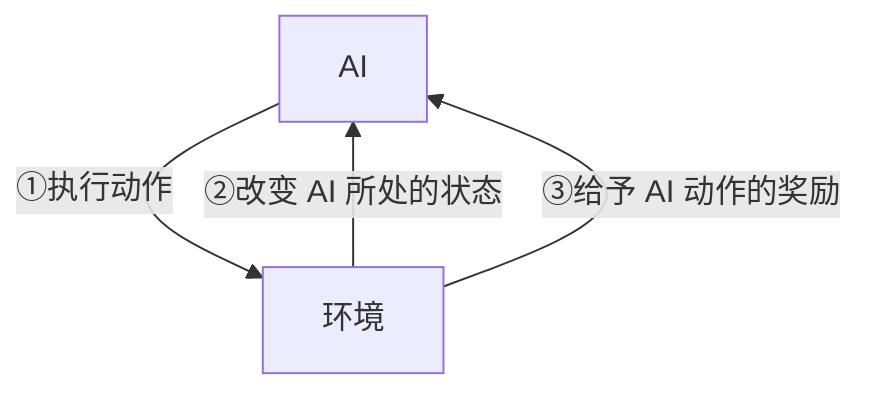
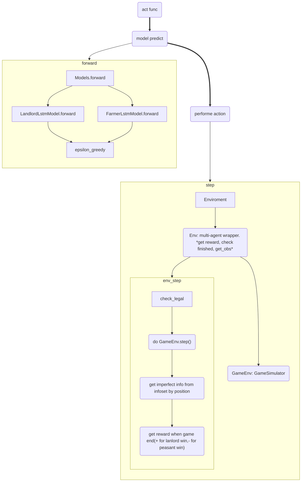
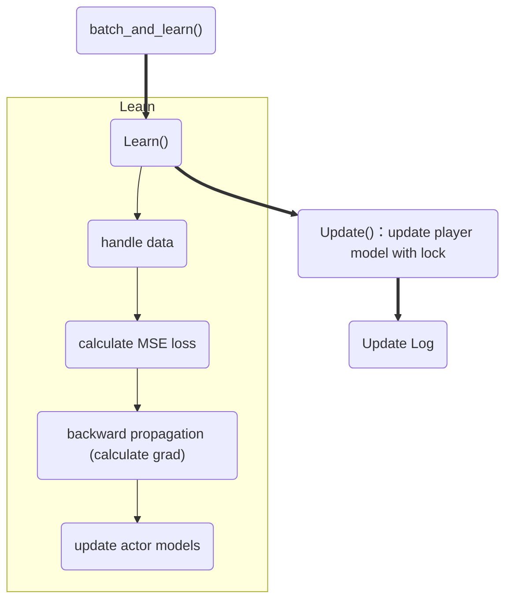

## 前言

在 DeepSeek 的帮助下，读论文DouZero: Mastering DouDizhu with Self-Play Deep Reinforcement Learning，利用蒙特卡罗方法和深度强化学习实现的斗地主 AI DouZero。 ~~顺便试试新安装的 Mermaid 渲染插件。~~ <!-- more -->

## 一些背景

### 为什么强化学习可以解决斗地主问题？

在本科时接触到的**监督学习**中，AI 是通过阅读大量的数据，来学习哪些是正确的操作，那些是错误的操作。在这个概念上，又细分出了完全监督、弱监督、无监督，分别指代数据集完全被标注好、数据集标注有误或不完全等、AI自行归纳打标签等情况。但是，总的来说它们都是从静态的数据中进行学习，然后针对环境给出一次反馈就行了。

但是在游戏等互动环境中情况并不是这样的，AI 每进行一次操作，环境就发生一次改变。监督学习总不可能针对每一种情况对进行训练，那完全不切实际。而这就是强化学习所试图解决的问题。如下图所示



AI会不断给出动作，然后环境告诉 AI 发生了什么变化，AI 因此获得什么奖励。AI 的目标是追求奖励最大化。

> 见参考 3，蘑菇书第一章。

在斗地主中，玩家不断地丢出手牌（动作），对手也会据此打出自己的手牌（状态变化），直到有人手牌率先打光，就赢了（奖励）。这正是强化学习的逻辑。

## 强化学习此前在斗地主中面临了什么问题？

DouZero 团队指出，斗地主有非常大的状态空间和动作空间，而此前的 RL 研究主要关注的还是情况更简单状态空间更小的情况，如蘑菇书第一章图1.25提到的OpenAI Gym库中内置的这些小游戏：


不仅如此，斗地主还需要同时讲究配合（农民和农民）和对抗（农民和地主），而且需要非常多步才能决出最后的胜者，这些特点都需要针对性的处理。综合考虑这些特性，Douzero 团队提出了 Deep Monte-Carol（DMC） 方法，即神经网络来生成蒙特卡洛动作。他们指出，相比于策略梯度方法，DMC 可以更好地利用已知动作去推断未知动作的奖励状态（例如， *K 带 3* 如果是一个有奖励的操作，那么可以猜测 J 带 3 也是一个不错的操作）。而相比于 DQN（Deep Q-learning）， DMC 不仅能更轻松的处理这么大的动作空间和长游戏步骤，价值估计还是无偏的。因为 DMC 采用的是蒙特卡洛方法，而 DQN 中有取最大值的操作，因此会有些偏高。

当然，蒙特卡洛方法作为一种简单暴力的算法，它也有它的不足，那就是随机采样的结果太多样了，需要较多的采样次数才能收敛，因此往往并不高效。但是 DouZero 团队相信，通过并行训练的手段，DMC 可以快速采集样本，从而解决大量采样耗时长的问题。

## DouZero的算法逻辑

通常在 RL 中使用蒙特卡洛算法过程如下

0. 初始化。有一个值为零的价值表 $Q$ 表；有一个随机生成的策略 $π$ 指示在给定状态 $s$ 下需要采取的动作 $a$。
1. 生成一场对局（episode），其中玩家使用的策略是 $π$，得到的回报是 $r$。
2. 把对局中的状态动作对 $(s,a)$ 的 $Q$ 表值依据 $r$ 更新。例如多局游戏中都有这个状态动作对时，对得到的多个 $r$ 取均值。
3. 更新策略。策略$π(s)←\arg\max Q(s,a)$，即策略更新采取为 $s$ 状态下采用 $Q$ 表中该状态下价值最大的动作 $a$。

当然，我们无法直接应用到斗地主问题上————那样的话这篇论文也就不需要存在了。研究者对算法做了一些修改以适应问题需要，具体来说包括：引入神经网络代替 $Q$ 表、对牌型编码、设计并行的演员采样机制。

首先，由于斗地主的状态空间很大，维护一个巨大的 $Q$ 表不现实。而且前面提到的泛化也无法实现，因为 `K 带 3` 和 `J 带 3` 显然是两个格子里的值，$Q$ 表无法体现出二者在状态空间中的相似性。因此 DouZero 中将 $Q$ 表换成了 $Q$ 神经网络。

$Q$ 网络接收动作和状态，然后告诉我们对应的 $Q$ 值。这样，我们就需要将动作和状态进行编码，并且定义哪些信息是**状态**。

此外，我们还需要将动作和手牌等编码为一个 $4×13$ 的矩阵如下，其中的 0/1 值代表是否包含这张牌。


而我们给网络输入的状态信息则如下，其中包括牌桌上可以观察到的信息的编码，也包括历史出牌信息的编码。对牌桌上可以观察到的信息（例如另外两家余下的手牌，已经出的牌等）编码和上面的矩阵自然是一样的。历史出牌信息则通过 LSTM （长短时记忆网络）进行编码。


上图还告诉我们，Q 网络是一个六层的 MLP（多层感知器） 结构，或者叫全连接网络，因为 MLP 中每层都全连接到下一层。

第二步中我们还需要更新 Q 网络。这里，DouZero 采取了 MSE（Mean Square Error）方法，即均方差损失，它的公式如下

$$
MSE=\frac{1}{n}​×∑(actual–prediction)^2
$$

其中真实值（$actual$）为实际交互得到的回报值，预测值（$prediction$）为 $Q$ 网络给出的当前动作状态对的 $Q$ 值。

更具体地，在实现上，训练被分成了两个大逻辑板块。

第一个是 *执行器 (Actor)* 的逻辑，它负责第 0 步和第 1 步，即玩游戏采样数据并写入一个共享缓冲区中。如前所述将斗地主中的三人命名为 **L**（地主，landlord）、**U** （地主上家，Up）和 **D**（地主下家，Down）。那么每局游戏中都在同时训练三个位置上的 Actor。它们被一定程度地区隔开来以免互相影响，并且如前所述，采用多线程同时让多个 Actor 采集数据加快速度。Actor 的逻辑如下。


第二个就是 *学习器（Leaner）* ，它负责第 3 步和第 4 步。即不断从缓冲区中提取数据，学习并更新 $Q$ 网络。

## 读代码

上面这些其实算是对论文和对应知乎专栏文章的复读。下面对应读代码解析。

### train()

由 `train.py` 进入 `dmc.py` 中的 `train()` 函数是主函数。它首先根据参数（`flags`）确定有多少可供 `actor` 训练的设备（`devices`），并对应初始化数据结构。如果 `flags` 中有要求导入模型并继续训练，还需要导入对应的训练检查点（line 61 - 144）。

初始化的数据结构中有以下比较重要：

- `position`: 一个字符串，表示玩家的身份：地主（L）、地主上家（U）、地主下家（D）。
- `models`: 一个字典，包含 device 个 Model 结构，Model 中则对应存储了三个位置（L、U、D）的模型等信息。这是给 actor 用的。
- `buffers[]`：缓冲区，即 actor 写入， learner 读出的共享数据区。大小为 devices * position(L,U,D) 个。
- `learner_model`：顾名思义，给 learner 用的模型。运行在 flags 中指定的 training_device 上。
- `locks`, `position_lock` ：线程锁，locks 共 devices * 3（L/U/D）把，用于锁定 actors 写入的 buffers；position_lock 共 3 把（L/U/D），用于锁定 learner_model 的对应 position。
- `free_queue` 和 `full_queue` ：`buffers` 状态指示。由于各 `actor` 和 `learner` `都属于不同线程，所以我们需要锁保证通信的稳定。free_queue` 标识了那些空闲的 `buffer` 区， `full_queue` 标识了被填满的那些 buffer 区。一度以为是表示“全部的 buffer ”，但是这里 full 取的是“满了”（have been filled）的意思

- 随后，程序启动 `devices` * `num_actors` 个 `actor` 线程，即同一个 `device` 下有 `num_actors` 个 `actor` 使用同一个 `model` 进行游戏。

```python
# Starting actor processes
for device in device_iterator:
    for i in range(flags.num_actors):
        actor = ctx.Process(
            target=act,
            args=(i, device, free_queue[device], full_queue[device], models[device], buffers[device], flags))
        actor.start()
        actor_processes.append(actor)
```

当然为了让 `actor` 有地方可写，我们需要先给 `free_queue` 中放入一些位置：

```python
for device in device_iterator:
    for m in range(flags.num_buffers):
        free_queue[device]['landlord'].put(m)
        free_queue[device]['landlord_up'].put(m)
        free_queue[device]['landlord_down'].put(m)
```

然后我们启动$devices×num_threads×position$ 个 `learner` 线程，即同一个 `device` 下每 `num_threads` 个线程里，都有 3 个（position 个） `learner` 针对不同的 `position` 学习。他们的的学习结果更新到唯一的 `learner_model` 中不同的 `position` 上。

```python
for device in device_iterator:
    for i in range(flags.num_threads):
        for position in ['landlord', 'landlord_up', 'landlord_down']:
            thread = threading.Thread(
                target=batch_and_learn, name='batch-and-learn-%d' % i, args=(i,device,position,locks[device][position],position_locks[position]))
            thread.start()
            threads.append(thread)
```

最后，调用 `checkpoint` 函数输出检查点。

在解析代码之前，我们还需要先解释代码中观察到信息（obs）的命名，以便于后续的理解：

- `z`: 最近 15 步历史移动信息。由于三家各走一步为一轮，所以编码是 $5×162$ 而不是$15×54$。
- `x_no_action`: 一堆特征，其中既没有动作特征，也不包括历史信息。
- `x_batch` : 一批次的特征，其中包括动作特征，不包括历史信息。
- `z_batch` : 被拓展为一个批次的历史移动信息。
- `legal_actions` : 合法的动作。


由上表可以看出，x_no_action + z 就是我们所谓的 state。

所谓批次（batch）就是一堆同类的信息（或者更严谨的说，一堆独立的样本）。但是我们哪来一堆同类的信息？其实，一个批次里，每个样本都是一致的信息，以玩家手上的手牌为例：

```python
def _get_obs_landlord(infoset):
    # ...
    my_handcards = _cards2array(infoset.player_hand_cards)
    my_handcards_batch = np.repeat(my_handcards[np.newaxis, :],
                                   num_legal_actions, axis=0)
```

可以看见手牌的批次只是将手牌重复了 `num_legal_actions` 次。其实，之所以要拓展为批次，是为了在当前的 state 下，并行计算评估所有合法动作的价值，从而找出最有价值的动作。因此，也就需要将所有的 state 信息拓展为 `num_legal_actions` 个。因此，动作特征的批次就并不一样：

```python
def _get_obs_landlord(infoset):
    # ...
    my_action_batch = np.zeros(my_handcards_batch.shape)
    for j, action in enumerate(infoset.legal_actions):
        my_action_batch[j, :] = _cards2array(action)
```

### act()

act 函数是 `actor` 逻辑运行的地方。它会首先创建游戏环境（Environment），然后在这个环境下利用模型预测不断出牌，直到决出胜者，然后将这个过程中产生的数据传输到 `buffers` 中。随后，它再开一局新游戏，不断重复上述过程，直到我们打断它。如下图所示，其中粗线表现 `act()` 中的流转，细线表示该步的内部细节。



#### 预测出牌：forward()

前面的流程图中， `forward` 就是利用模型生成 action 的步骤。当然，如`## DouZero的算法逻辑` 一节的图所示，我们需要输入一些参数。简单来说，`act()` 调用 model 中的 `forward()` 函数获得数据，并对应更新 `buf`。如下所示

```python
def act(...)
    try:
        # some init steps

        while True:
            while True:
                obs_x_no_action_buf[position].append(env_output['obs_x_no_action'])
                obs_z_buf[position].append(env_output['obs_z'])
                with torch.no_grad(): 
                    agent_output = model.forward(position, obs['z_batch'], obs['x_batch'], flags=flags)
```

model.forward() 根据 position 决定调用 LandlordLstmModel（地主）还是 FarmerLstmModel（农民）。它们的 forward 函数将一系列参数输入 Q网络（六层全连接）得到结果，并经历一次$ϵ−greedy$ 得到结果。

```python
class LandlordLstmModel(nn.Module):
    def forward(self, z, x, return_value=False, flags=None):
        lstm_out, (h_n, _) = self.lstm(z)
        lstm_out = lstm_out[:,-1,:]
        # 六层全连接网络
        x = torch.cat([lstm_out,x], dim=-1)
        x = self.dense1(x)
        x = torch.relu(x)
        x = self.dense2(x)
        x = torch.relu(x)
        x = self.dense3(x)
        x = torch.relu(x)
        x = self.dense4(x)
        x = torch.relu(x)
        x = self.dense5(x)
        x = torch.relu(x)
        x = self.dense6(x)
        if return_value:# 如果设定为直接输出概率最大的结果
            return dict(values=x)
        else: # epsilon-greedy
            if flags is not None and flags.exp_epsilon > 0 and np.random.rand() < flags.exp_epsilon:
                action = torch.randint(x.shape[0], (1,))[0]
            else:
                action = torch.argmax(x,dim=0)[0]
            return dict(action=action)
```

#### 执行操作：step()

在这一步中，`actor` （或者说 act()）将 `forward()` 中确定的 `action` 编码并放进游戏中执行。

```python
def act(...)
    try:
        # some init steps

        while True:
            while True:
                _action_idx = int(agent_output['action'].cpu().detach().numpy())
                action = obs['legal_actions'][_action_idx] 
                obs_action_buf[position].append(_cards2tensor(action))
                size[position] += 1
                position, obs, env_output = env.step(action)
```

env，即游戏环境，如前面的 act() 流程图 所示，在源代码中共有三层，从顶到底分别是 `Environment`，`Env` 和 `GameEnv`。

最底层的 `GameEnv` 是纯粹的游戏模拟逻辑，它根据 action 更新玩家手牌、指定下一个玩家出牌的玩家、判断游戏有没有结束、收集场上信息（infoset）……如下：（有简化）

```python
class GameEnv(object):
    def step(self):
        action = self.players[self.acting_player_position].act(self.game_infoset) # 获取玩家类（dummyAgent）中的动作
        assert action in self.game_infoset.legal_actions # 断言动作是合法的

        if len(action) > 0:
            self.last_pid = self.acting_player_position

        if action in bombs:
            self.bomb_num += 1

        self.last_move_dict[self.acting_player_position] = action.copy()

        self.card_play_action_seq.append(action)
        self.update_acting_player_hand_cards(action) #更新手牌

        self.played_cards[self.acting_player_position] += action

        # ...

        # 检查游戏状态并更新信息集
        self.game_done()
        if not self.game_over:
            self.get_acting_player_position()
            self.game_infoset = self.get_infoset()
```

`Env` 是 `GameEnv` 的一层抽象。使用它的目的是“分离玩家和游戏，让接口更有 OpenAI Gym 的风格”（class Env, def init(),“isolate players and environments to have a more gym style interface.”）。更具体来说，Env 除了将动作传递到 GameEnv 中执行以外，还将 GameEnv 中的完美信息集合（infoset） 变成并不完美的信息集合：显然，每个玩家都不可能观察到别的玩家的手牌，玩家的信息是不完整的。

```python
def step(self, action):
    """
    Step function takes as input the action, which
    is a list of integers, and output the next observation,
    reward, and a Boolean variable indicating whether the
    current game is finished. It also returns an empty
    dictionary that is reserved to pass useful information.
    """
    assert action in self.infoset.legal_actions
    self.players[self._acting_player_position].set_action(action) # 将动作传递给玩家（DummyAgent），GameEnv 稍后会从这里取出它们
    self._env.step() # 所以这里无需传参
    self.infoset = self._game_infoset
    done = False
    reward = 0.0
    if self._game_over:
        done = True
        reward = self._get_reward()
        obs = None
    else:
        obs = get_obs(self.infoset) # 从 infoset 中根据 position 获取不完美的观察信息
    return obs, reward, done, {}
```

最顶层的 `Enviroment` 负责将观察信息通过 CUDA 转化为张量，并在游戏结束时，自动重置游戏。

```python
def _format_observation(obs, device):
    """
    A utility function to process observations and
    move them to CUDA.
    """
    position = obs['position']
    if not device == "cpu":
        device = 'cuda:' + str(device)
    device = torch.device(device)
    x_batch = torch.from_numpy(obs['x_batch']).to(device)
    z_batch = torch.from_numpy(obs['z_batch']).to(device)
    x_no_action = torch.from_numpy(obs['x_no_action'])
    z = torch.from_numpy(obs['z'])
    obs = {'x_batch': x_batch,
           'z_batch': z_batch,
           'legal_actions': obs['legal_actions'],
           }
    return position, obs, x_no_action, z

class Environment:
    def step(self, action):
        obs, reward, done, _ = self.env.step(action)

        self.episode_return += reward
        episode_return = self.episode_return 

        if done:
            obs = self.env.reset()
            self.episode_return = torch.zeros(1, 1)

        position, obs, x_no_action, z = _format_observation(obs, self.device)
        reward = torch.tensor(reward).view(1, 1)
        done = torch.tensor(done).view(1, 1)
        
        return position, obs, dict(
            done=done,
            episode_return=episode_return,
            obs_x_no_action=x_no_action,
            obs_z=z,
            )
```

#### 传递信息

最后，完成一局游戏，我们将数据传送到共享缓存中。

```python
for p in positions:
    while size[p] > T: # 每次传送 T 个数据
        index = free_queue[p].get() # 请求 T 个槽位以供写入
        if index is None:
            break
        for t in range(T): # 将前 T 步数据复制到共享缓冲区 buffers 中
            buffers[p]['done'][index][t, ...] = done_buf[p][t]
            buffers[p]['episode_return'][index][t, ...] = episode_return_buf[p][t]
            buffers[p]['target'][index][t, ...] = target_buf[p][t]
            buffers[p]['obs_x_no_action'][index][t, ...] = obs_x_no_action_buf[p][t]
            buffers[p]['obs_action'][index][t, ...] = obs_action_buf[p][t]
            buffers[p]['obs_z'][index][t, ...] = obs_z_buf[p][t]
        full_queue[p].put(index) # 对应标记这些槽位已被填满
        done_buf[p] = done_buf[p][T:] # 清除前 T 被读取了的元素，
        episode_return_buf[p] = episode_return_buf[p][T:]
        target_buf[p] = target_buf[p][T:]
        obs_x_no_action_buf[p] = obs_x_no_action_buf[p][T:]
        obs_action_buf[p] = obs_action_buf[p][T:]
        obs_z_buf[p] = obs_z_buf[p][T:]
        size[p] -= T
```

### batch_and_learn()

`batch_and_learn` 即学习的主函数，这个程序根据 actor 的数据进行学习，并更新 actor 的 model。如下：



在数据处理中，我们首先将观察信息中的 `x_no_action` 和 `action` 组合为 `x`（即 state + action - 历史移动信息）。然后将 x、z、target 都展平，因为我们的网络是全连接的。此外，还计算了游戏的平均回报。

```python
obs_x_no_action = batch['obs_x_no_action'].to(device)
obs_action = batch['obs_action'].to(device)
obs_x = torch.cat((obs_x_no_action, obs_action), dim=2).float()
obs_x = torch.flatten(obs_x, 0, 1)
obs_z = torch.flatten(batch['obs_z'].to(device), 0, 1).float()
target = torch.flatten(batch['target'].to(device), 0, 1)
episode_returns = batch['episode_return'][batch['done']]
mean_episode_return_buf[position].append(torch.mean(episode_returns).to(device))
```

随后，在加锁以后，我们开始修改模型。

首先，我们通过 MSE 公式计算损失。前面提到，它的公式为：
$$
MSE=\frac{1}{n}​×∑(actual–prediction)^2
$$

```python
def compute_loss(logits, targets):
    loss = ((logits.squeeze(-1) - targets)**2).mean()
    return loss
```

清除历史梯度，然后计算损失的梯度，并反向传播更新模型。

```python
optimizer.zero_grad() # 清除历史梯度
loss.backward() # 计算损失的梯度
nn.utils.clip_grad_norm_(model.parameters(), flags.max_grad_norm) # 限制模型最大梯度
optimizer.step() # 反向传播，更新模型
```

最后，同步到 `actor` 模型上

```python
for actor_model in actor_models.values():
    actor_model.get_model(position).load_state_dict(model.state_dict())
```

## 参考文献

1. Douzero GitHub 开源代码：kwai/DouZero: [[ICML 2021] DouZero: Mastering DouDizhu with Self-Play Deep Reinforcement Learning | 斗地主AI](https://github.com/kwai/DouZero?tab=readme-ov-file)
2. 作者中文博文：[DouZero斗地主AI深度解析，以及RLCard工具包介绍 - 知乎](https://zhuanlan.zhihu.com/p/526723604)
3. 《Easy RL》，第一章 强化学习基础: [第一章 强化学习基础](https://datawhalechina.github.io/easy-rl/#/chapter1/chapter1)
