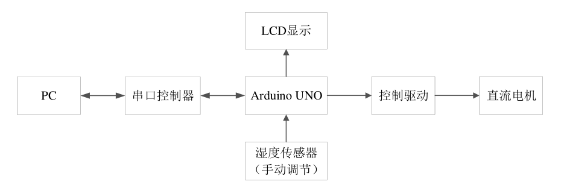
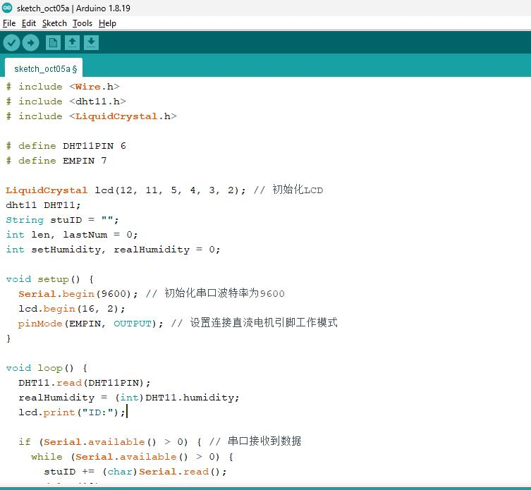
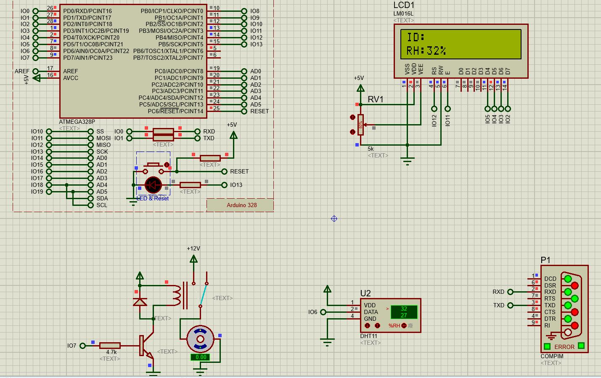
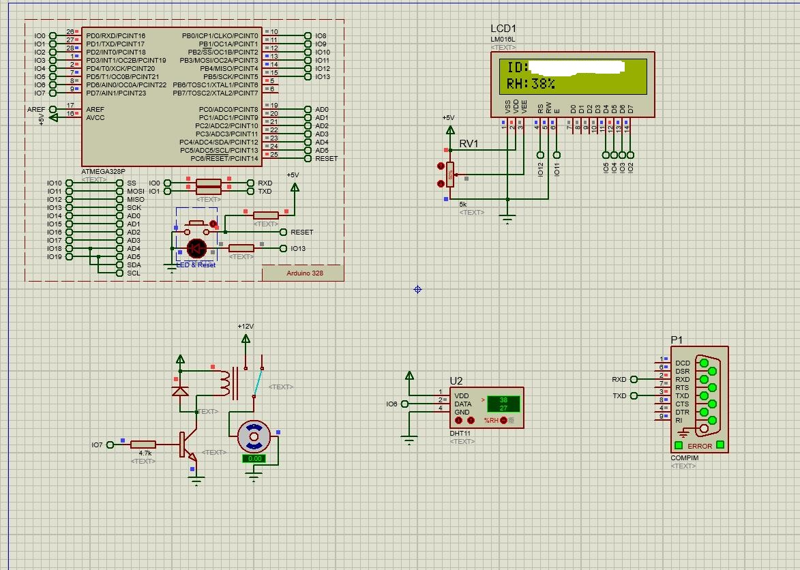
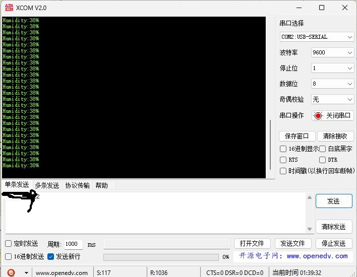
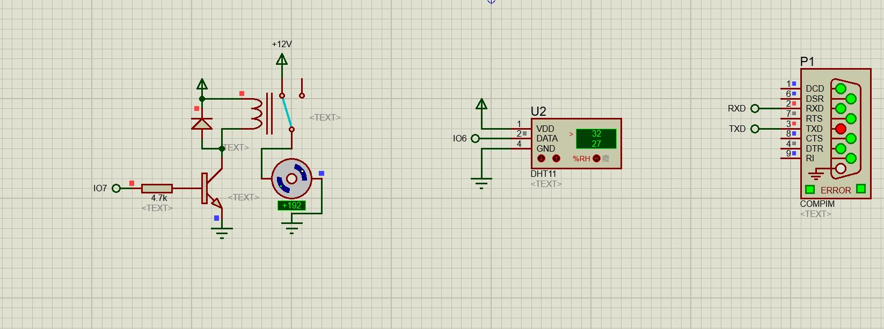

## 前言

A 测实验报告，实现一个根据湿度控制电机转动的简单嵌入式系统的仿真。此前没有接触过嵌入式，这也是我对嵌入式的初步认识。 <!-- more -->

## 实验要求

使用 Arduino UNO 微控制器，搭建一个 PC 上位机远程湿度检测控制系统。

具体来说功能可以分为如下两部分：

- 通信：串口和 Arduino UNO 系统双工通信。我们操作通过串口向仿真系统发送学号。同时，我们还可以从串口读取当前湿度。

- 反馈：当环境湿度低于等于预定的湿度时， Arduino UNO 启动直流电机转动；当环境湿度高于预定的湿度时，直流电机停止转动。 Arduino UNO 还会在 LCD 屏上显示之前输入的学号和湿度。

上述预定湿度的值为百分之“30+学号末位数”。

软件环境：推荐采用 Proteus 8.9 SP2 及以上仿真软件，Arduino IDE，串口调试助手软件，虚拟串口驱动软件 Virtual Serial Port Driver（VSPD）。

所谓微控制器，是一个高度集成的芯片，内部有 CPU 、内存等等，对外则提供各类接口，单片机也是一种微控制器，而 Arduino UNO 微控制器的核心是一个 Atmega328P 单片机。 Arduino 平台也有对应的软件开发工具，例如官方的 Arduino IDE。采用 VSC 等当然也可以，不过我们只是做一次作业，也就不花心思在如何配环境了。总之，透过这些软件，我们可以编写代码输送到开发板（此处是 Arduino UNO）中去执行。

而上述提到的串口则是“串行端口”的意思，具体来说，我们这里指的是 COM 口，即 Commuinication Port。串口通信较为简单而稳定。

整体系统框图如下：



## 实验环境

- Windows 11 个人电脑
- Proteus 8.9 SP2：仿真软件，老师提供的电路就是 Proteus 工程文件。
- XCOM 2.0：用来在串口上进行通信的；
- VSPD 7.2.308：Virtual Serial Port Dirver，用来创建虚拟一对端口的，因为我们的微控制器是虚拟的，所以与之通信的串口也是虚拟的；
- Arduino 1.8.19：给 Arduino 开发板编写程序的 IDE；这里需要注意版本问题，官网的 2.x 版本似乎是无法看到 VSPD 创建的虚拟端口的；
- DHT 11 库：DHT 11 数字温湿度传感器配套的库，因为我们是在 Arduino 平台进行开发，因此需要对应的在 Arduino 平台的库，在这里我采用的是 Github 上找的 [adidax/dht11: DHT11 library for Arduino](https://github.com/adidax/dht11)。

## 操作步骤

1. 环境配置，安装上述软件，并将 DHT 11 库添加到 Arduino IDE 中。其中 Proteus 需要安装在 C 盘根目录下，不然会识别不到库。
2. 通过 VSPD 添加一对虚拟串口 COM1 和 COM2 进行虚拟串联。
   
3. XCOM 设置波特率为 9600，测试虚拟端口之间能否正常通信；并保持 COM1 为打开状态。
   
4. 我们没有可以上传的真实开发板，而验证本身并不会传到开发板中，所以我们设置 Arduino IDE 的首选项（Preference），将编译和上传勾选。随后在 Arduino IDE 内编写程序并"验证"（程序代码见后文）。控制台会告诉我们在appdata 下的一个文件下下生成了编译文件，其中该目录下的 *.ino.hex 就是验证后编译生成的机器码文件，它就是我们要的。（注意这是临时文件，每次验证目录都会变化）。
   
5. 在 Proteus U1 里指定编译生成的 .HEX 文件，P1 指定端口为 COM1。
   
6. 运行仿真工程，输入学号，调节湿度，观察电机状态和 LCD 显示信息。

## 仿真结果

我的学号尾号为2，因此预定的湿度值是 32%。
初始状态只显示湿度值：

此时通过 XCOM（COM2） 发送学号，可以看到 LCD 显示屏上成功显示学号，并且 PC 机接收到湿度值。注意 XCOM 使用的 COM 2 而且应该处于打开状态，因为与之配对的 COM1 在模拟开发板上，我们无法通过 COM1 给COM1 自己发消息。


将设定湿度改到 32%，此时电机开始转动：


## 程序代码

```cpp
# include <Wire.h>
# include <dht11.h> 
# include <LiquidCrystal.h> 
 
# define DHT11PIN 6
# define EMPIN 7
 
LiquidCrystal lcd(12, 11, 5, 4, 3, 2); // 初始化LCD
dht11 DHT11;
String stuID = ""; 
int len, lastNumNum = 0;
int setHumidity, realHumidity = 0;
 
void setup() {
  Serial.begin(9600); // 初始化串口波特率为9600
  lcd.begin(16, 2);
  pinMode(EMPIN, OUTPUT); // 设置连接直流电机引脚工作模式
}
 
void loop() {
  DHT11.read(DHT11PIN);
  realHumidity = (int)DHT11.humidity;
  lcd.print("ID:");
 
  if (Serial.available() > 0) { // 串口接收到数据
    while (Serial.available() > 0) {
      stuID += (char)Serial.read();
      delay(10); 
    }
    lcd.println(stuID);
    
    len = stuID.length();
    lastNum = stuID.substring(len - 3, len - 2).toInt(); // 取末尾数字
    setHumidity = 30 + lastNum;
    
    stuID = "";
    len = 0;
    lastNum = 0;
  }
  
  // LCD 输出 RH
  lcd.setCursor(0, 1); // 将光标定位在第0列，第1行（即下一列）
  lcd.print("RH:");
  lcd.print(realHumidity);
  lcd.println("%");
  lcd.home(); // 光标返回左上角
    
  // 串口输出 RH
  Serial.print("Humidity:");
  Serial.print(realHumidity); 
  Serial.println("%");
  
  if (realHumidity <= setHumidity) {
    digitalWrite(EMPIN, HIGH); // 电机转动
  } else {
    digitalWrite(EMPIN, LOW);
  }
 
  delay(1000);
}
```

## 参考

1. [2023西电A测：湿度测控仿真系统-CSDN博客](https://blog.csdn.net/weixin_58243145/article/details/133042452)
2. [西电A测：串口通信仿真-CSDN博客](https://blog.csdn.net/flovst/article/details/126812241)
